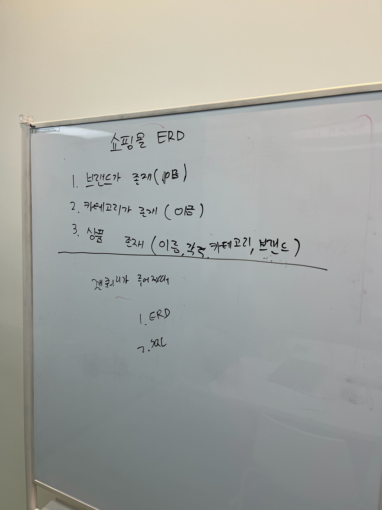
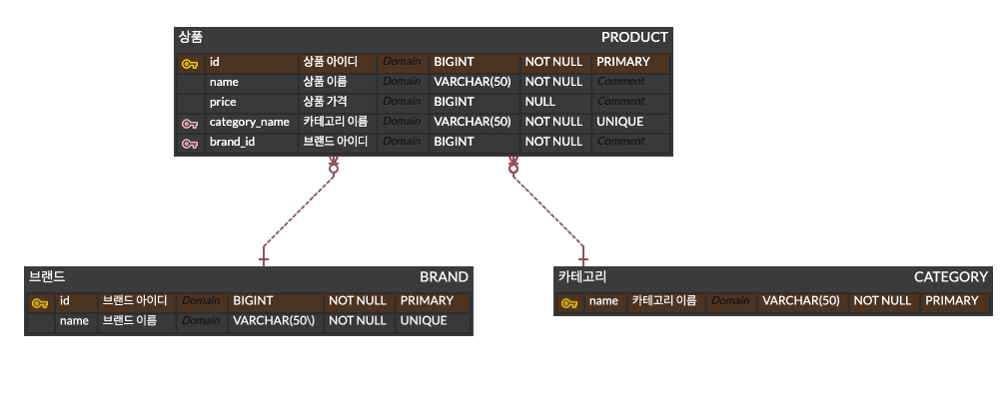

## ERD



https://www.erdcloud.com/d/NjBCsHrj63LetWKgF

## SQL

### 카테고리 별로 최저가격인 브랜드와 가격을 조회하고 총액이 얼마인지 확인할 수 있어야 합니다. (카테고리, 가격)

- 카테고리 별로 최저가격인 브랜드, 가격 조회
    
    ```sql
    SELECT
        p.category_name,
        p.price,
        b.name AS brand_name
    FROM
        PRODUCT p
    JOIN
        BRAND b ON p.brand_id = b.id
    JOIN (
        SELECT
            category_name,
            MIN(price) AS min_price
        FROM
            PRODUCT
        GROUP BY
            category_name
    ) sub ON p.category_name = sub.category_name AND p.price = sub.min_price;
    ```
    

- 카테고리 별로 최저가격인 물건의 총액 구하기
    
    ```sql
    SELECT 
        SUM(min_price) AS total_min_price
    FROM (
        SELECT 
            MIN(price) AS min_price
        FROM 
            PRODUCT
        GROUP BY 
            category_name
    ) sub;
    ```
    

### 단일 브랜드로 전체 카테고리 상품을 구매할 경우 최저가격인 브랜드와 총액이 얼마인지 확인할 수 있어야 합니다.

```sql
SELECT 
    b.name AS brand_name,
    SUM(sub.price) AS total_price
FROM (
    SELECT 
        brand_id,
        category_name,
        MIN(price) as price
    FROM 
        PRODUCT p
    GROUP BY 
        brand_id, category_name
) sub
JOIN 
    BRAND b ON sub.brand_id = b.id
GROUP BY 
    brand_id;
```

### 특정 카테고리에서 최저가격 브랜드와 최고가격 브랜드를 확인하고 각 브랜드 상품의 가격을 확인할 수 있어야 합니다.

- `Electronics` 카테고리의 최저가격 브랜드, 가격 확인

    ```sql
    SELECT
        p.category_name,
        p.price AS min_price,
        b.name AS brand_name
    FROM
        PRODUCT p
    JOIN
        BRAND b ON p.brand_id = b.id
    JOIN (
        SELECT
            category_name,
            MIN(price) AS min_price
        FROM
            PRODUCT
        WHERE
            category_name = 'Electronics'
        GROUP BY
            category_name
    ) sub ON p.category_name = sub.category_name AND p.price = sub.min_price
    WHERE
        p.category_name = 'Electronics';
    ```

- `Electronics` 카테고리의 최고가격 브랜드, 가격 확인
    
    ```sql
    SELECT
        p.category_name,
        p.price AS max_price,
        b.name AS brand_name
    FROM
        PRODUCT p
    JOIN
        BRAND b ON p.brand_id = b.id
    JOIN (
        SELECT
            category_name,
            MAX(price) AS max_price
        FROM
            PRODUCT
        WHERE
            category_name = 'Electronics'
        GROUP BY
            category_name
    ) sub ON p.category_name = sub.category_name AND p.price = sub.max_price
    WHERE
        p.category_name = 'Electronics';
    ```