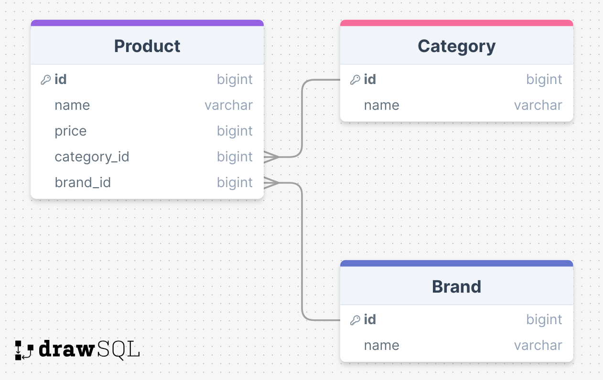

### ERD




### 1. 카테고리 별로 최저가격인 브랜드와 가격을 조회하고 총액이 얼마인지 확인할 수 있어야 합니다.
```sql
with min_and_total_price_per_category as (
    select c.id as category_id, c.name as category_name, min(p.price) as min_price, sum(p.price) as total_price
    from product p
    inner join category c on p.category_id = c.id
    group by c.id
) 
select category_name, min_price, b.name as brand_name, total_price 
    from product p
    inner join category c on p.category_id = c.id
    inner join brand b on p.brand_id = b.id
    inner join min_and_total_price_per_category mp on mp.category_id = c.id and mp.min_price = p.price
```

### 2. 단일 브랜드로 전체 카테고리 상품을 구매할 경우 최저가격인 브랜드와 총액이 얼마인지 확인할 수 있어야 합니다.
```sql
select b.name, sum(p.price) as total_price
    from product p
    inner join category c on p.category_id = c.id
    inner join brand b on p.brand_id = b.id
    group by (b.id)
    order by total_price asc
    limit 1
```

### 3. 특정 카테고리에서 최저가격 브랜드와 최고가격 브랜드를 확인하고 각 브랜드 상품의 가격을 확인할 수 있어야 합니다.
```sql
with min_and_max_price_per_category as (
    select c.id as category_id, c.name as category_name, min(p.price) as min_price, max(p.price) as max_price
    from product p
    inner join category c on p.category_id = c.id
    group by c.id
)
select category_name, b.name, p.name, min_price as price
    from product p
    inner join brand b on p.brand_id = b.id
    inner join min_and_max_price_per_category mpc on mpc.category_id = p.category_id and mpc.min_price = p.price
union all
select category_name, b.name, p.name, max_price as price
    from product p
    inner join brand b on p.brand_id = b.id
    inner join min_and_max_price_per_category mpc on mpc.category_id = p.category_id and mpc.max_price = p.price
    order by category_name
```