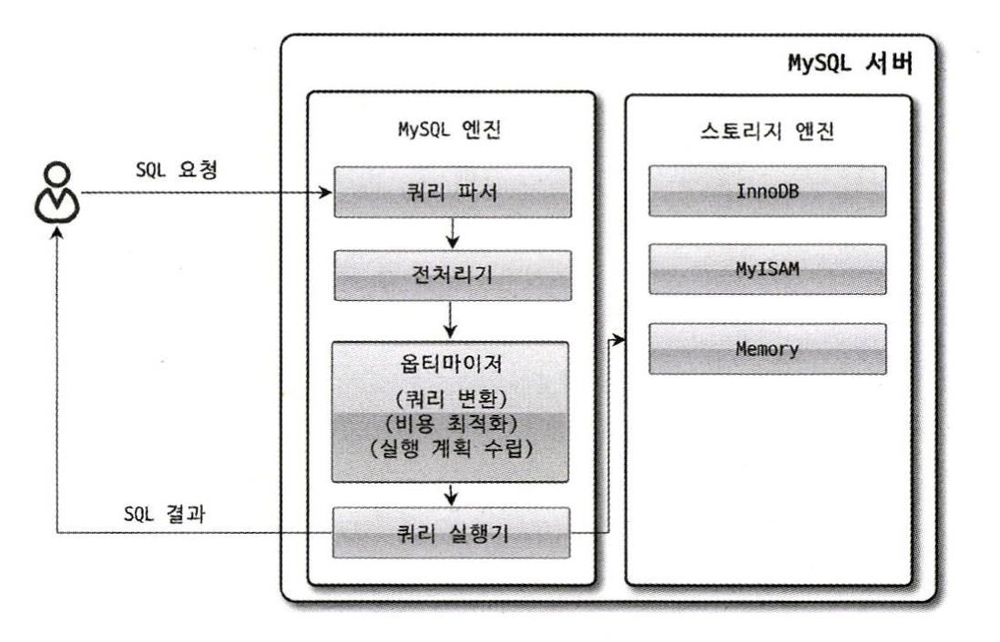

# MySQL 엔진 아키텍처

## 쿼리 실행 구조



MySQL이 쿼리를 처리하는 과정을 간략하게 나타낸 그림이다.  
SQL 요청이 MySQL 엔진의 쿼리 파서에 들어오는 부분부터 스토리지 엔진에 `핸들러 요청`하는 과정까지 나타낸다.  

### 쿼리 파서

쿼리 파서는 사용자 요청으로 들어온 `쿼리 문장을 Token으로 분리하여 트리 형태의 구조로 만들어 내는` 작업을 의미한다.  
쿼리 문장의 기본적인 문법 오류는 이 과정에서 발견되고 사용자에게 오류 메시지를 전달하게 된다.  

#

### 전처리기

파서에서 만들어진 `트리를 바탕으로 쿼리 문장에 구조적인 문제점이 있는지 확인`한다.  
해당 객체의 존재 여부와 객체의 접근 권한 등을 확인하는 과정을 여기서 수행한다.  

#

### 옵티마이저

DBMS의 두뇌에 해당하며, 사용자의 요청으로 들어온 `쿼리 문장을 저렴한 비용으로 가장 빠르게 처리할지를 결정`하는 역할을 담당한다.  

#

### 실행 엔진

옵티마이저와 핸들러의 중간에서 관리자의 역할을 수행한다.  
실행 엔진은 만들어진 계획대로 각 핸들러에게 요청해서 받은 결과를 또 다른 핸들러 요청의 입력으로 연결하는 역할을 담당한다.  

#

### 핸들러 (스토리지 엔진)

핸들러는 MySQL 서버 가장 밑단에서 실행 엔진의 요청에 따라 `데이터를 디스크에 저장하고 읽어 오는 역할`을 담당한다.  
    
핸들러는 결국 스토리지 엔진을 의미하며  
스토리지 엔진에 따라 `MyISAM 스토리지 엔진`이 될 수도 있고 `InnoDB 스토리지 엔진`이 될 수도 있다.  

---

## 쿼리 캐시

기존 MySQL 서버의 쿼리 캐시는 테이블의 데이터가 변경되면 캐시에 저장된 결과 중 변경된 테이블과 관련된 것들은 모두 삭제해야 했다.  
이는 심각한 동시 처리 성능 저하를 유발했고, MySQL 서버가 발전되면서 쿼리 캐시는 많은 버그의 원인이 되기도 했다.  

MySQL 8.0으로 올라오면서 쿼리 캐시는 MySQL 서버의 기능에서 완전히 제거되었다.  

---

## 스레드 풀

MySQL 서버 엔터프라이즈 에디션에서만 스레드 풀 기능을 제공한다.  
아래는 엔터프라이즈 에디션에 포함된 스레드 풀 대신 Percona Server에서 제공하는 스레드 풀 설명이다.  
  
스레드 풀은 내부적으로 사용자의 요청을 처리하는 스레드 개수를 줄여서 MySQL 서버의 CPU 개수가 제한된 개수의 스레드 처리에만 집중할 수 있게 해서 자원 소모를 줄이는 것이 목적이다. 
때문에 스케줄링 과정에서 CPU 시간을 제대로 확보하지 못하는 경우에는 쿼리 처리가 더 느려질 수도 있다.  

제한된 수의 스레드만으로 CPU가 처리하도록 적절히 유도하면 CPU의 프로세서 친화도를 높이고, 불필요한 컨텍스트 스위치를 줄여 오버헤드를 낮출 수 있다. 
기본적으로 CPU의 코어의 개수와 스레드 수를 맞추는 것이 프로세서 친화도를 높이는데 좋다. 

```ini
[thread_pool_size]

Percona Server의 스레드 풀은 기본적으로 CPU 코어의 개수만큼 스레드 그룹을 생성하는데
스레드 그룹의 개수는 thread_pool_size 시스템 변수를 변경해서 조정할 수 있다.
```

```ini
[thread_pool_oversubscribe]

처리해야 할 요청이 생기면 MySQL 서버는 스레드 풀로 처리를 이관하는데
만약 이미 스레드 풀이 처리중인 작업이 있는 경우
thread_pool_oversubscribe 시스템 변수에 설정된 개수만큼 추가로 더 받아들여서 처리한다

이 값이 너무 크면 스케줄링해야 할 스레드가 많아져서 스레드 풀이 비효율적으로 작동할 수도 있다.
```

```ini
[thread_pool_stall_limit]

스레드 그룹의 모든 스레드가 일을 처리하고 있다면
스레드 풀은 해당 스레드 그룹에 새로운 스레드를 추가할지 아니면 기존 작업 스레드가 처리를 완료할 때 까지 기다릴지 여부를 판단해야한다.

스레드 풀의 타이머 스레드는 주기적으로 스레드 그룹의 상태를 체크해서
thread_pool_stall_limit 시스템 변수에 정의된 시간만큼 기다렸다가,
처리중인 작업이 끝나지 않으면 새로운 스레드를 생성해서 스레드 그룹에 추가한다.

응답 시간에 민감한 서비스라면 thread_pool_stall_limit 시스템 변수를 적절히 낮춰서 설정해야한다.
하지만 그렇다고 0에 가까운 값으로 설정하는 것은 좋지 않으며, 오히려 스레드 풀을 사용하지 않는 편이 낫다.
```

Percona Server의 스레드 풀 플러그인은  
`선순위 큐와 후순위 큐`를 이용해 작업을 재배치하여 특정 트랜잭션이나 쿼리를 우선적으로 처리할 수 있는 기능도 제공한다.  

먼저 시작된 트랜잭션 내에 속한 SQL을 빨리 처리해주면 해당 트랜잭션이 가지고 있던 잠금이 빨리 해제되고 잠금 경합을 낮춰 전체적인 성능을 향상시킬 수 있다.

---

## 트랜잭션 지원 메타데이터

MySQL 8.0 버전부터 메타데이터와 시스템 테이블 모두 InnoDB 스토리지 엔진에 저장되도록 개선됐으며 두 정보를 모두 모아 mysql DB에 저장하고 있다.  
mysql DB는 통째로 mysql.ibd라는 이름의 테이블스페이스에 저장된다. 그래서 MySQL 서버의 데이터 디렉토리에 존재하는 mysql.ibd라는 파일은 다른 ibd 파일과 함께 특별히 주의해야 한다.
> 테이블의 구조 정보와 스토어드 프로그램 등의 정보를 데이터 딕셔너리 또는 메타데이터라 한다.  
> MySQL 서버가 작동하는 데 기본적으로 필요한 테이블들을 시스템 테이블이라 한다.
  
InnoDB가 지원하는 트랜잭션 덕분에 스키마 변경 작업 중간에 MySQL 서버가 비정상적으로 종료된다 하더라도 스키마 변경이 완전한 성공 또는 완전한 실패로 정리된다.
8.0 버전 이전의 파일 기반 메타데이터를 사용할 때 처럼 데이터베이스나 테이블이 깨지는 현상이 더이상 발생하지 않게 된 것이다.

## Reference 

**위 내용은 책 RealMySQL 8.0을 구입하여 읽고 정리하였습니다.**
- [도서 홈페이지 https://wikibook.co.kr/realmysql801/](https://wikibook.co.kr/realmysql801/)
