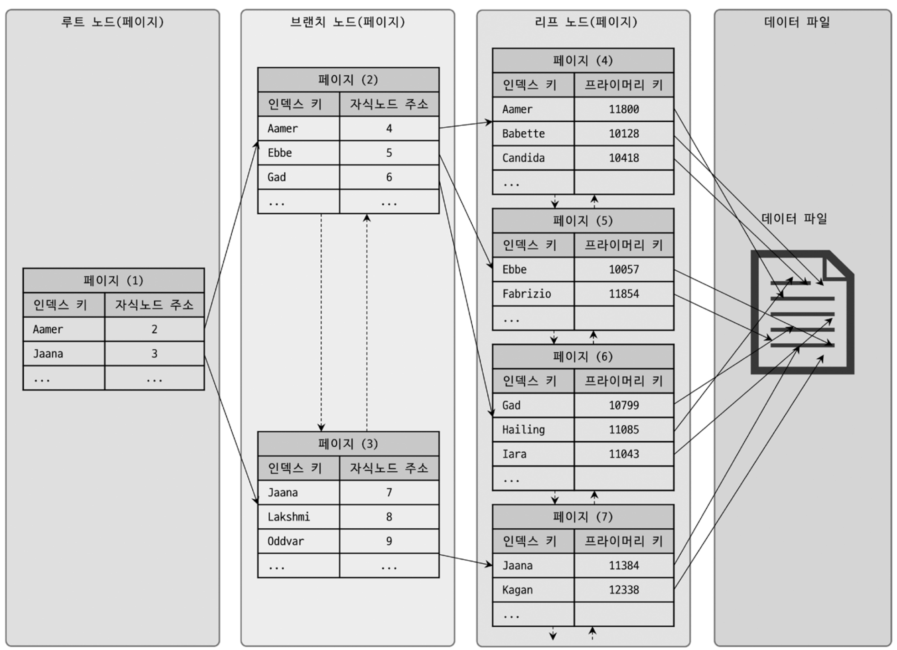
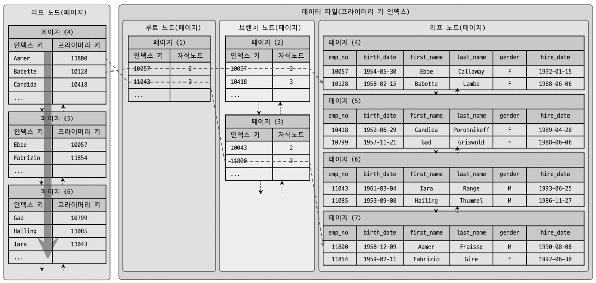

# 인덱스

인덱스의 기본적인 특징은 바로 `정렬`이다. DBMS에서 `인덱스`는 데이터의 저장(INSERT, UPDATE, DELETE) 성능을 희생하고, 데이터의 읽기 속도를 높이는 기능이다.
  
그래서 테이블의 인덱스를 추가할지 말지 결정하는 조건은 **데이터 저장 속도를 어디까지 희생할 수 있는지**, **읽기 속도를 얼마나 더 빠르게 만들어야 하는지**에 달려있다.
  
## B-Tree 인덱스



`B-Tree`는 Blanced Tree의 줄임말로, 데이터베이스 인덱싱 알고리즘 가운데 가장 일반적으로 사용되고, 가장 먼저 도입된 알고리즘이다.
  
최상위에 하나의 `루트 노드`, 중간의 노드를 `브랜치 노드`, 가장 하위에 있는 노드를 `리프 노드`라 부른다.
  
데이터베이스에서 인덱스와 실제 데이터가 저장된 데이터는 따로 관리되는데, 인덱스의 리프 노드는 항상 실제 데이터 레코드를 찾아가기 위한 주솟값을 가지고 있다.
  
인덱스의 키 값은 모두 정렬돼 있지만, 데이터 파일의 레코드는 정렬돼 있지 않고 임의의 순서로 저장되어 있다.



InnoDB 테이블의 인덱스와 데이터 파일의 관계를 나타낸 그림이다.

InnoDB 스토리지 엔진 테이블에서는 프라이머리 키가 ROWID 역할을 한다. 또한 인덱스를 통해 레코드를 읽을 때 데이터 파일을 바로 찾아가지 못한다.
  
위 그림처럼 인덱스에 저장되어 있는 프라이머리 키 값을 이용해 프라이머리 키 인덱스를 한 번 더 검색한 후, 프라이머리 키 인덱스의 리프 페이지에 저장되어 있는
레코드를 읽는다.
  
즉 모든 `세컨더리 인덱스`에서 데이터 레코드를 읽기 위해서는 반드시 프라이머리 키를 저장하고 있는 B-Tree를 한번 더 검색해야 한다.

- B-Tree 인덱스 검색이 사용 가능한 경우는 다음과 같다.
  - 100% 일치 검색
  - 값의 앞부분만 일치하는 검색
  - 부등호("<", ">") 비교 조건의 검색

- B-Tree 인덱스 검색이 사용 불가능한 경우는 다음과 같다.
  - 키 값의 뒷부분만 검색하는 경우
  - 인덱스의 키 값에 변형이 가해진 후 비교되는 경우
  - 함수나 연산을 수행한 결과로 정렬 또는 검색하는 작업

### 인덱스 추가

새로운 키 값이 B-Tree에 저장될 때 테이블의 스토리지 엔진에 따라 새로운 키 값이 즉시 인덱스에 저장될 수도 있고 그렇지 않을 수도 있다.  
  
InnoDB 스토리지 엔진은 필요하다면 인덱스 키 추가 작업을 체인지 버퍼를 통해 지연시켜 처리하는 것이 가능하다. 하지만 프라이머리 키나 유니크 인덱스의 경우
중복 체크가 필요하기 때문에 즉시 B-Tree에 추가하거나 삭제한다.
  
B-Tree에 저장될 때는 저장될 키 값을 이용해 B-Tree상의 적절한 위치를 검색해야 한다. 저장될 위치가 결정되면 레코드의 키 값과 대상 레코드의 주소 정보
를 B-Tree의 리프 노드에 저장한다. 리프 노드가 꽉 차서 더 저장할 수 없을 때는 리프 노드가 분리 돼야 하고, 상위 브랜치 노드까지 처리의 범위가 넓어진다.

### 인덱스 삭제

B-Tree에서 키 삭제는 해당 키 값이 저장된 B-Tree의 리프 노드를 찾아서 그냥 삭제 마크만 하면 작업이 완료된다.
삭제 마킹된 인덱스 키 공간은 계속 그대로 방치하거나 재활용하는 것이 가능하다.
  
### 인덱스 키 변경

인덱스 키 값은 그 값에 따라 저장될 리프 노드의 위치가 결정되므로 단순히 인덱스상의 키 값만 변경하는 것은 불가능하다.
  
B-Tree의 키 값 변경 작업은 먼저 키 값을 삭제한 후, 다시 새로운 키 값을 추가하는 형태로 처리된다. 
이 또한 InnoDB 스토리지 엔진에서는 체인지 버퍼를 활용해 지연처리가 가능하다.

### 인덱스 키 검색

인덱스를 구축하는 이유는 빠른 검색을 위해서다. 인덱스 트리 탐색은 SELECT 뿐만 아니라 UPDATE, DELETE를 처리하기 위해 항상 해당 레코드를 먼저
검색해야 할 경우에도 사용된다.
  
인덱스를 이용한 검색에서 중요한 사실은 인덱스의 키 값에 변형이 가해진 후에는 절대 B-Tree의 빠른 검색을 이용할 수 없다는 점이다.
이미 변형된 값은 B-Tree 인덱스에 존재하는 값이 아니다. 따라서 `함수`나 `연산`을 수행한 결과로 정렬한다거나 검색하는 작업은
B-Tree의 장점을 이용할 수 없으므로 주의해야 한다.

InnoDB 스토리지 엔진에서 레코드 잠금이나 넥스트 키락은 인덱스를 잠근 후 테이블의 레코드를 잠그기 때문에 UPDATE, DELETE 시 테이블에
적절히 사용할 수 있는 인덱스가 없으면 불필요하게 많은 레코드를 잠그기 때문에 인덱스 설계가 중요하다.

## B-Tree 인덱스 사용에 영향을 미치는 요소

B-Tree 인덱스는 `인덱스를 구성하는 칼럼의 크기`와 `레코드의 건수`, 그리고 `유니크한 인덱스 키 값의 개수` 등에 의해 성능에 영향 받는다.
  
### 인덱스 키 값의 크기

InnoDB 스토리지 엔진은 디스크에 데이터를 저장하는 기본 단위를 `페이지` 또는 `블록`이라고 한다. 이는 디스크 읽기 쓰기 작업의 최소 단위가 된다.
  
인덱스 키 값의 크기가 커지면 하나의 페이지에 저장할 수 있는 키의 개수가 적어진다.  
키의 개수가 적어진다는 것은 데이터를 얻기 위해 여러 `페이지`를 읽게 된다는 뜻이고 그만큼 느려진다는 것을 의미한다.
  
인덱스 키 값의 크기가 길어지는 것은 전체적인 인덱스 크기가 커진다는 것을 의미하는데, 인덱스를 캐시해두는 InnoDB 버퍼 풀은 크기가 제한적이기 때문에
하나의 레코드를 위한 인덱스 크기가 커지면 캐시할 수 있는 레코드 수는 줄어든다. 이는 메모리의 효율이 떨어지는 결과를 야기한다.

### B-Tree 깊이

인덱스 키 값의 크기가 커지면 `페이지`가 많아지고, 이는 B-Tree의 깊이가 깊어진다는 뜻이다.  
  
B-Tree의 깊이는 조회에서 디스크를 몇 번 읽어야 하는지와 직결된 문제기 때문에 성능 저하와 관련이 있다.

### Cardinality(기수성)

인덱스 키 값중 중복된 값이 많으면 `Cardinality`는 낮아진다.  
기수성이 낮은 인덱스를 사용할 경우 필요 없는 데이터가 함께 조회되기 때문에 비효율적이다.  

```sql
SELECT * FROM tb_test
WHERE country = 'KOREA' AND city = 'SEOUL';
```

- 1만 건의 레코드중, 인덱스 country의 유니크 값이 10개인 경우
  - 인덱스와 일치하는 레코드는 대략 1000건 예상.
  - 1000건중 city가 SEOUL인 레코드 1건일 경우 999건은 불필요하게 읽은 데이터.
- 1만 건의 레코드중, 인덱스 country의 유니크 값이 1000개인 경우
  - 인덱스와 일치하는 레코드는 대략 10건 예상
  - 10건중 city가 SEOUL인 레코드 1건일 경우 9건만 불필요하게 읽은 데이터.
 
### 읽어야 하는 레코드 건수

인덱스를 이용한 손익 분기점이 얼마인지 판단할 필요가 있다. 일반적인 DBMS의 옵티마이저는 인덱스를 통해 레코드 1건을 읽는 것이
테이블에서 직접 레코드 1건을 읽는 것 보다 4~5배 정도 비용이 더 많은 작업으로 예측한다.
  
그래서 인덱스를 통해 읽어야 할 레코드의 건수가 전체 테이블 레코드의 20~25%를 넘어서면 테이블 풀 스캔을 하고 필요한 레코드만 가려내는 방식이 인덱스를 사용하는 것 보다 오히려 효율적이라고 볼 수 있다.

## Reference 

**위 글은 책 RealMySQL 8.0을 구입하여 읽고 정리한 내용입니다.**
- [도서 홈페이지 https://wikibook.co.kr/realmysql801/](https://wikibook.co.kr/realmysql801/)
