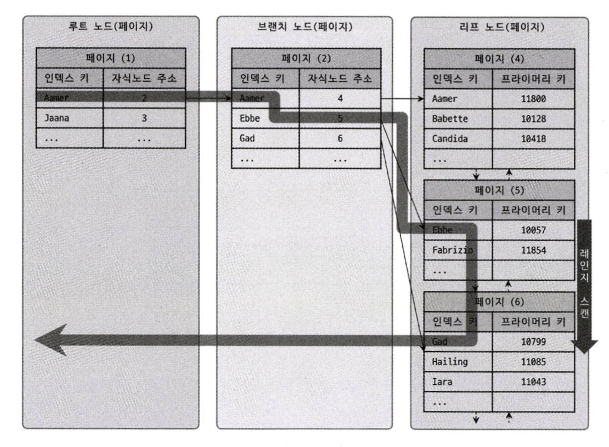
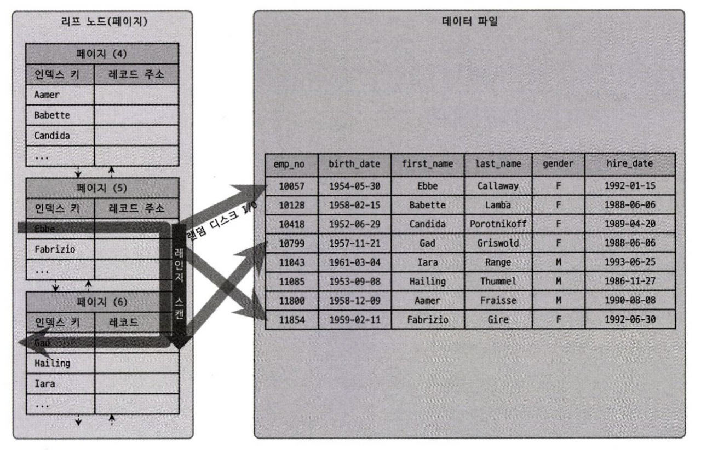
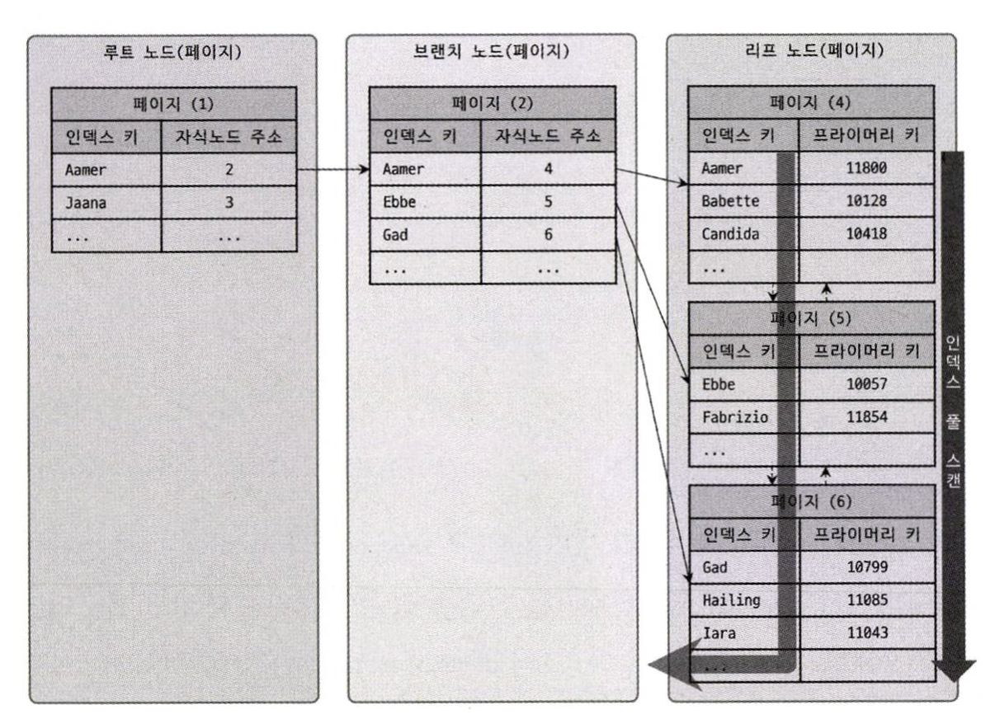
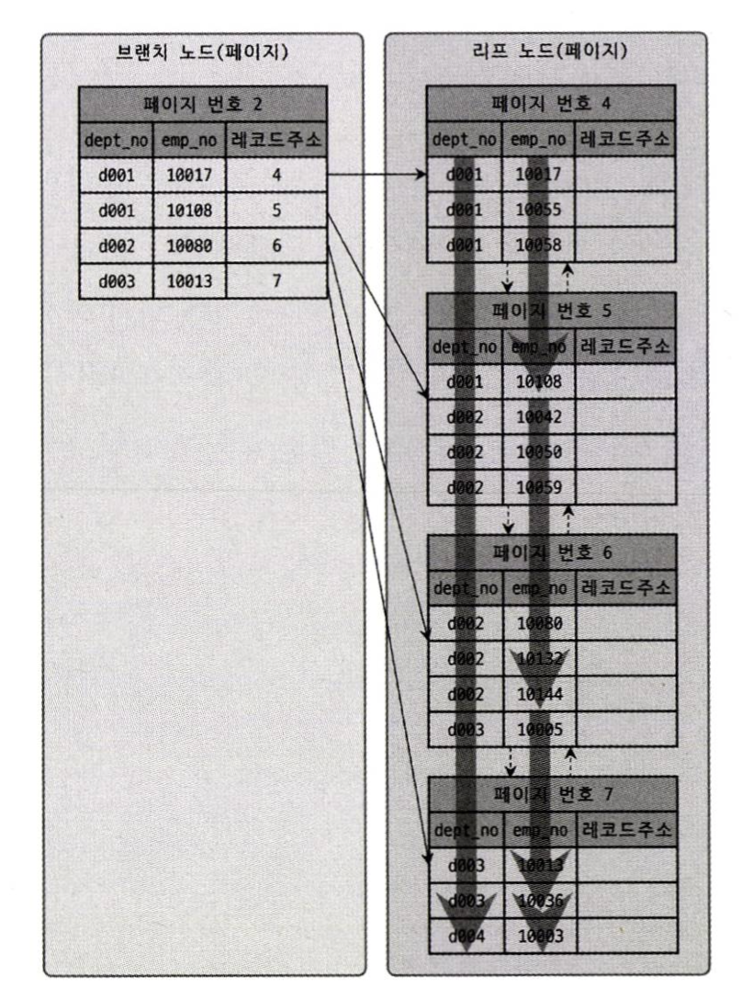
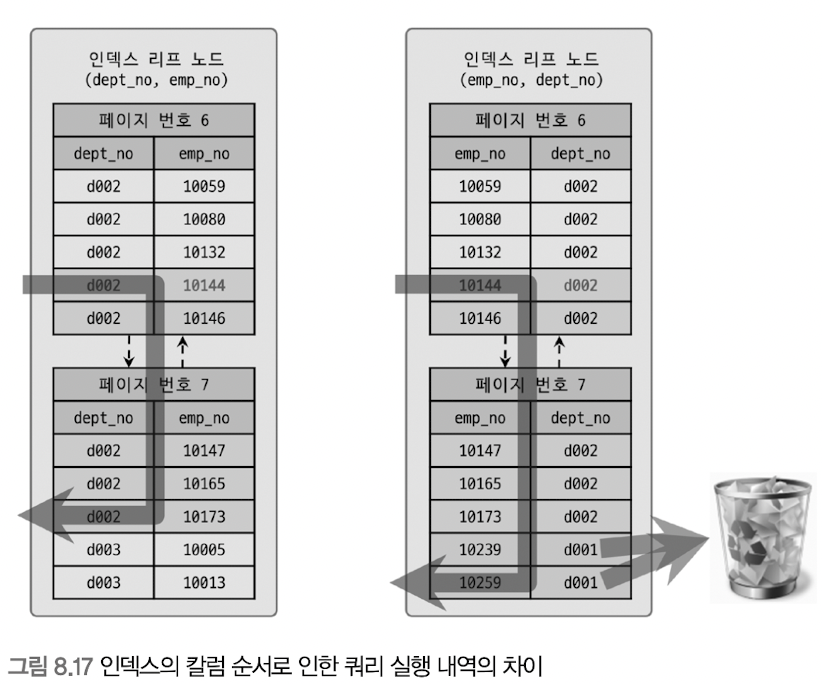

# 인덱스

## 인덱스 레인지 스캔

`인덱스 레인지 스캔`은 검색해야할 범위가 정해졌을 때 사용되는 방식이다.  


  
`인덱스 레인지 스캔`은 B-Tree의 루트 페이지부터 리프 페이지까지 내려가 범위 탐색의 시작점을 찾는다. 그 이후 **정렬된 인덱스 데이터를 범위 탐색의 끝점까지 순서대로 쭉 읽는다**. 이때, 쭉 읽는 것을 `스캔`이라고 표현한다.

- `인덱스 탐색 (index seek)`
  - 조건에 만족하는 값이 저장된 위치를 찾는다.
- `인덱스 스캔 (index scan)`
  - 탐색 과정에서 찾은 위치부터 필요한 만큼 인덱스를 쭉 읽는다.
- `레코드 읽어오기`
  - 스캔 과정에서 읽어온 **인덱스 키**와 **레코드 주소**를 이용해 레코드가 저장된 페이지를 가져오고, 최종 레코드를 읽어온다.

InnoDB의 인덱스는 B+Tree 구조로 되어있기 때문에 리프 노드 페이지가 LiknedList 로 연결된다. 정렬된 상태와 리프 노드의 연결로 시작점만 찾으면 적은 비용으로 쭉 읽을 수 있기 때문에 매우 효율적이다.


  
다만 리프 노드에서 검색 조건에 일치하는 데이터를 찾으면 실제 데이터 파일에서 레코드를 읽어오는 과정이 필요하다. 이때, **레코드를 읽어오는 과정에서 디스크 랜덤 I/O**가 발생한다. 따라서 인덱스를 통해 데이터 레코드를 읽는 작업은 비용이 많이 드는 작업이다.

인덱스 레인지 스캔은 랜덤 I/O를 사용하는 반면, **테이블 풀 스캔은 순차 I/O**를 사용한다. 따라서 읽어야할 데이터 레코드가 **20~25%를 넘으면, 테이블의 데이터를 직접 읽는 것이 더 효율적이다.**

## 커버링 인덱스

쿼리를 실행시킬 수 있는 데이터를 모두 가지고 있는 인덱스를 `커버링 인덱스`라고 한다.  
  
이런 경우 인덱스 레인지 스캔 과정에서 레코드를 읽어오는 작업이 필요 없을 수 있다. 쿼리를 실행하기 위해 필요한 정보가 모두 인덱스에 존재하기 때문이다. 이런 경우 레코드를 읽지 않으므로 성능이 향상된다.

## 인덱스 풀 스캔



인덱스를 처음부터 끝까지 모두 읽는 방식을 `인덱스 풀 스캔`이라한다. 대표적으로 쿼리 조건절에 사용된 컬럼이 인덱스의 첫 번째 컬럼이 아닌 경우 인덱스 풀 스캔 방식이 사용된다.
  
인덱스 풀 스캔은 테이블 전체를 읽는 것보다는 적은 디스크 I/O가 발생하기 때문에 테이블 전체를 읽는 것보다는 낫다고 볼 수 있다. 그러나 이 방법은 인덱스를 효율적으로 사용하지 못하는 것이다.

## 루스 인덱스 스캔

인덱스 레인지 스캔과 비슷하게 동작하지만, 중간에 필요없는 인덱스 키 값은 무시하고 다음으로 넘어가는 형태로 처리한다. 일반적으로 GROUP BY 또는 MIN , MAX 같은 집계 함수를 최적화 하능 경우에 사용된다.
  
### 인덱스 스킵 스캔

인덱스의 핵심은 값이 정렬돼 있다는 것이며, 이로 인해 인덱스를 구성하는 칼럼의 순서가 매우 중요하다는 것이다.
  
```sql
mysql> ALTER TABLE employees

ADD INDEX ix_gender_birthdate (gender, birth_date);
```

```sql
- // 인덱스를 사용하지 못하는 쿼리
mysql> SELECT * FROM employees WHERE birth_date>= '1965-02-01';

-// 인덱스를 사용할 수 있는 쿼리
mysql> SELECT * FROM employees WHERE gender='M' AND birth_date>='1965-02-01';
```

gender 칼럼에 대한 비교 조건이 없는 첫 번째 쿼리는 인덱스를 사용할 수가 없었다. 주로 이런 경우에는 birth_date 칼럼부터 시작하는 인덱스를 새로 생성해야만 했다.
  
인덱스 스킵 스캔은 MySQL 8.0 버전부터 도입된 최적화 기능으로 조건절에 첫 번째 인덱스가 없어도 두 번째 인덱스만으로 인덱스를 검색할 수 있다.

MySQL 8.0 버전부터 도입된 인덱스 스킵 스캔을 비활성화하고, 실행 계획을 확인해보면 다음과 같다.

```sql
mysql> SET optimizer_switch='skip_scan=off'

mysql> EXPLAIN
       SELECT gender, birth_date
       FROM employees WHERE birth_ date>=' 1965-02-01';

| id     | table     | type     | key                 | Extra                                  | 
|  1     | employees | index    | ix_gender_birthdate | Using where; Using index               |
```

위 쿼리는 WHERE 조건절에 gender 칼럼에 대한 조건 없이 birth_date 칼럼의 비교 조건만 가지고 있기 때문에 쉽게 ix_gender_birthdate 인덱스를 효율적으로 사용할 수 없다.  
  
위의 실행 계획에서 type 칼럼이 "index" 라고 표시된 것은 인덱스 풀 스캔을 의미하므로 인덱스를 비효율적으로 사용한 것이다.
  
이 예제 쿼리는 gender 칼럼과 birth_date 칼럼만 있으면 처리를 완료할 수 있기 때문에 커버링 인덱스에 의해 인덱스를 스캔했지만, 만약 예제 쿼리가 employees 테이블의 모든 칼럼을 가져와야 했다면 테이블 풀스캔을 실행했을 것이다.

이제 MySQL 8.0 버전부터 도입된 인덱스 스킵 스캔을 활성화하고, 실행 계획을 확인해보면 다음과 같다.

```sql
mysql> SET optimizer_switch='skip_scan=on'

mysql> EXPLAIN
       SELECT gender, birth_date
       FROM employees WHERE birth_ date>=' 1965-02-01';

| id     | table     | type     | key                 | Extra                                  | 
|  1     | employees | range    | ix_gender_birthdate | Using where; Using index for skip scan |
```

이번에는 쿼리 실행 계획에서 type 칼럼 값이 "range"라고 표시됐는데, 이는 인덱스에서 꼭 필요한 부분만 읽었다는 것을 의미한다.
  
그리고 실행 계획의 Extra 칼럼에 "Using index for skip scan" 이라는 문구는 ix_gender_birthdate 인덱스에 의해 인덱스 스킵 스캔을 활용해 데이터를 조회했다는 것을 의미한다.

## 다중 칼럼 인덱스

실제 서비스용 데이터베이스에서는 2개 이상의 칼럼을 포함하는 인덱스가 더 많이 사용된다. 두 개 이상 칼럼으로 구성된 인덱스를 `다중 칼럼 인덱스`라고 한다.
  


다중 칼럼 인덱스에서 중요한 것은 인덱스의 두 번째 칼럼은 첫 번째 칼럼에 의존해서 정렬되어 있다는 점이다.  
때문에 레인지 스캔, 인덱스 스킵 스캔같은 방법들을 생각해 봤을 때, 인덱스 내에서 각 칼럼의 위치가 상당히 중요하며, 아주 신중히 결정해야 한다.

---

## B-Tree 인덱스의 정렬 및 스캔 방향

인덱스를 생성할 때 설정한 정렬 규칙에 따라 인덱스의 키 값은 항상 오름차순이거나 내림차순으로 정렬되어 저장된다.  
인덱스를 어느 방향으로 읽을지는 옵티마이저가 쿼리에 따라 실시간으로 만들어 내는 실행 계획에 따라 달라질 수 있다.
  
MySQL 8.0 부터 다음과 같은 정렬 순서를 혼합한 인덱스도 생성할 수 있게 됐다.
```sql
mysql> CREATE INDEX ix_teamname_userscore ON employees (team_name ASC, user_score DESC);
```

MySQL 옵티마이저는 인덱스는 항상 오름차 순으로 정렬되어 있지만 인덱스를 최솟값부터 읽으면 오름차순으로 값을 가져올 수 있고, 최댓값부터 거꾸로 읽으면 내림차순으로 값을 가져올 수 있다는 사실을 이미 알고있다.

쿼리의 ORDER BY 처리나 MIN(), MAX() 함수 등의 최적화가 필요한 경우에도 MySQL 옵티마이저는 인덱스의 읽기 방향을 전환해서 사용하도록 실행 계획을 만들어낸다.

### 내림차순 인덱스

특정 칼럼에 대해 역순으로 정렬하는 쿼리만 날릴 수 있다면 다음 2개의 인덱스중에서 어떤 것을 선택하는 것이 좋을까? 두 인덱스 모두 동일한 성능을 보일까?
  
```sql
> mysql> CREATE INDEX ix_firstname_asc  ON employees (first_name ASC  );
> mysql> CREATE INDEX ix_firstname_desc ON employees (first_name DESC );
```

```sql
mysql> SELECT * FROM t1 ORDER BY tid ASC LIMIT 12619775,1;
1 row in set (4.15 sec)

mysql> SELECT * FROM t1 ORDER BY tid DESC LIMIT 12619775,1;
1 row in set (5.35 sec)
```

비율로 따져보면 역순 정렬 쿼리가 정순 정렬 쿼리보다 28.9% 시간이 더 걸리는 것을 확인할 수 있다.
  
실제 내부적으로는 InnoDB에서 인덱스 역순 스캔이 인덱스 정순 스캔에 비해 느릴 수 밖에 없는 다음의 두 가지 이유가 있다.

- 페이지 잠금이 인덱스 정순 스캔에 적합한 구조이기 때문
- 페이지 내에서 인덱스 레고크가 단방향으로만 연결된 구조

`ORDER BY ... DESC` 하는 쿼리가 소량의 레코드에 드물게 실행되는 경우라면 내림차순 인덱스를 굳이 고려할 필요는 없지만,  
많은 레코드를 조회하면서 빈번하게 실행된다면 오름차순 인덱스보다는 내림차순 인덱스가 효율적이라고 볼 수 있다.
  
또한 많은 쿼리가 인덱스의 앞쪽만 또는 뒤쪽만 집중적으로 읽어서 인덱스의 특정 페이지 잠금이 병목이 될 것으로 예상된다면, 쿼리에서 자주 사용되는 정렬 순서대로 인덱스를 생성하는 것이 잠금 병목 현상을 완화하는데 도움이 될 것이다.

## B-Tree 인덱스의 가용성과 효율성

### 비교 조건의 종류와 효율성

다중 칼럼 인덱스에서 각 칼럼의 순서와 그 칼럼에 사용된 조건이 `동등 비교`인지, `범위 조건`인지에 따라 각 인덱스 칼럼의 활용 형태가 달라지며, 효율 또한 달라진다.

```sql
mysql> SELECT * FROM dept_emp WHERE dept_no='d002' AND emp_no >= 10114;
```

이 쿼리를 위해 테이블에 각각 칼럼의 순서만 다른 두가지 케이스로 인덱스를 생성했다고 가정하면 다음과 같은 차이가 발생한다.



위 그림은 인덱스 칼럼의 순서가 얼마나 중요한지를 보여준다.  
  
조건을 만족하는 레코드가 5건이라고 할 때,  
케이스 A는 5건의 레코드를 찾는데 꼭 필요한 5번의 비교 작업만 수행한 것이고  
케이스 B는 5건의 레코드를 찾는데 불필요하게 7번의 비교 작업을 수행한 것이다.
  
케이스 A 인덱스에서 두 조건과 같이 작업의 범위를 결정하는 조건을 `작업 범위 결정 조건`이라고 하고, 케이스 B 인덱스의 dept_no='d002' 조건과 같이 비교 작업의 범위를 줄이지 못하고 단순히 거름종이 역할만 하는 조건을 `필터링 조건`, `체크 조건`이라고 표현한다.
  
작업 범위를 결정하는 조건은 많으면 많을수록 쿼리의 처리 성능을 높이지만 체크 조건은 많다고 해서 쿼리 처리 성능을 높이지는 못한다. 오히려 쿼리 실행을 느리게 만들 때가 많다.

### 인덱스의 가용성과 효율성 판단

B-Tree 인덱스의 특성상 다음 조건에서는 `작업 범위 결정 조건`으로 인덱스를 사용할 수 없다.

- NOT-EQUAL로 비교된 경우 (`< >`, `NOT IN`, `NOT BETWEEN`, `IS NOT NULL`)
  - WHERE column < 'N'
  - WHERE column NOT IN (10, 11, 12)
  - WHERE column IS NOT NULL
- LIKE '%??' 앞부분이 아닌 뒷부분 일치 형태로 문자열 패턴이 비교된 경우
  - WHERE column LIKE '%승환'
  - WHERE column LIKE '_승환'
  - WHERE column LIKE '%승%'
- 스토어드 함수나 다른 연산자로 인덱스 칼럼이 변형된 후 비교된 경우
  - WHERE SUBSTRING(column, 1, 1) = 'X'
  - WHERE DAYOFMONTH(column) = 1
- NOT-DETERMINISTIC 속성의 스토어드 함수가 비교 조건에 사용된 경우
  - WHERE column = deterministic_function()
- 데이터 타입이 서로 다른 비교(인덱스 칼럼의 타입을 변환해야 비교가 가능한 경우)
  - WHERE char_column = 10
- 문자열 데이터 타입의 콜레이션이 다른 경우
  - WHERE utf8_bin_char_column = euckr_bin_char_column
 
다른 일반적인 DBMS에서는 NULL 값이 인덱스에 저장되지 않지만 MySQL 에서는 NULL 값도 인덱스에 저장된다.  
다음과 같은 WHERE 조건도 작업 범위 결정 조건으로 인덱슬르 사용한다.

```sql
mysql> .. WHERE column IS NULL ..
```
#

다중 칼럼으로 만들어진 인덱스의 경우이다.

```sql
INDEX ix_test( column_1, column_2, column_3, .., column_n )
```

- 작업 범위 결정 조건으로 인덱스를 사용하지 못한 경우
  - column_1 칼럼에 대한 조건이 없는 경우
  - column_1 칼럼의 비교 조건이 위의 인덱스 사용 불가 조건 중 하나인 경우
- 작업 범위 결정 조건으로 인덱스를 사용하는 경우
  - column_1 ~ column_(i~1) 칼럼까지 동등 비교 형태("=" 또는 "IN")로 비교
  - column_i 칼럼에 대해 다음 연산자 중 하나로 비교
    - 동등 비교("=")
    - 크다 작다 형태(">", "<")
    - LIKE로 좌측 일치 패턴(LIKE '승환%')
   
## Reference 

**위 글은 책 RealMySQL 8.0을 구입하여 읽고 정리한 내용입니다.**
- [도서 홈페이지 https://wikibook.co.kr/realmysql801/](https://wikibook.co.kr/realmysql801/)
