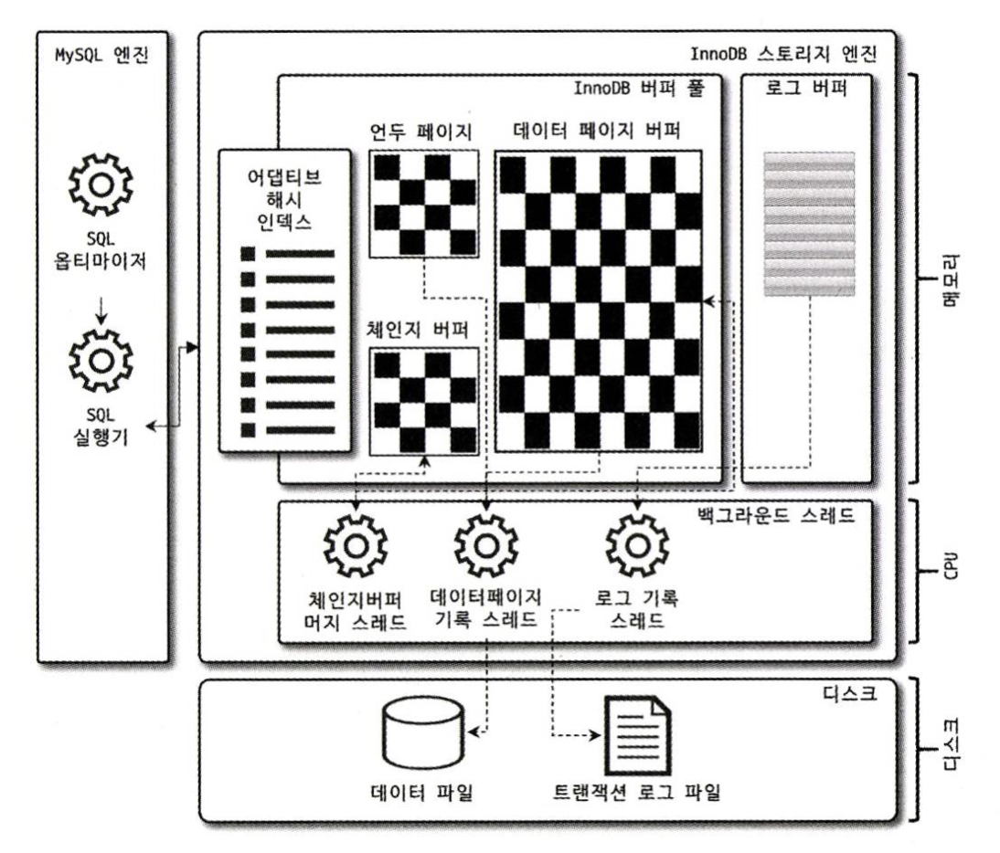
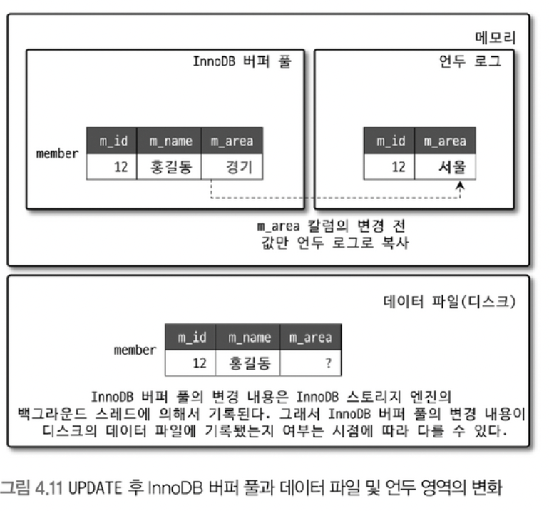

# InnoDB 스토리지 엔진 아키텍처



`InnoDB`는 MySQL에서 사용할 수 있는 스토리지 엔진 중 거의 유일하게 레코드 기반의 잠금을 제공한다.  
덕분에 높은 동시성 처리가 가능하고 안정적이며 성능이 뛰어나다.

## InnoDB 스토리지 엔진의 주요 특징

- [프라이머리 키에 의한 클러스터링](https://github.com/seokmyungham/TIL/blob/main/RealMySQL/innodb_engine_architecture_01.md#%ED%94%84%EB%9D%BC%EC%9D%B4%EB%A8%B8%EB%A6%AC-%ED%82%A4%EC%97%90-%EC%9D%98%ED%95%9C-%ED%81%B4%EB%9F%AC%EC%8A%A4%ED%84%B0%EB%A7%81)
- [외래 키 지원](https://github.com/seokmyungham/TIL/blob/main/RealMySQL/innodb_engine_architecture_01.md#%EC%99%B8%EB%9E%98-%ED%82%A4-%EC%A7%80%EC%9B%90)
- [Muti Version Concurrency Control](https://github.com/seokmyungham/TIL/blob/main/RealMySQL/innodb_engine_architecture_01.md#mvcc)
- [잠금 없는 일관된 읽기(Non-Locking Consistent Read)](https://github.com/seokmyungham/TIL/blob/main/RealMySQL/innodb_engine_architecture_01.md#%EC%9E%A0%EA%B8%88-%EC%97%86%EB%8A%94-%EC%9D%BC%EA%B4%80%EB%90%9C-%EC%9D%BD%EA%B8%B0)
- [자동 데드락 감지](https://github.com/seokmyungham/TIL/blob/main/RealMySQL/innodb_engine_architecture_01.md#%EC%9E%90%EB%8F%99-%EB%8D%B0%EB%93%9C%EB%9D%BD-%EA%B0%90%EC%A7%80)
- 자동화된 장애 복구
- [InnoDB 버퍼 풀](https://github.com/seokmyungham/TIL/blob/main/RealMySQL/innodb_engine_architecture_02.md#innodb-%EB%B2%84%ED%8D%BC-%ED%92%80)
- [Double Write Buffer](https://github.com/seokmyungham/TIL/blob/main/RealMySQL/innodb_engine_architecture_01.md#double-write-buffer)
- [언두 로그](https://github.com/seokmyungham/TIL/blob/main/RealMySQL/innodb_engine_architecture_01.md#%EC%96%B8%EB%91%90-%EB%A1%9C%EA%B7%B8)
- [체인지 버퍼](https://github.com/seokmyungham/TIL/blob/main/RealMySQL/innodb_engine_architecture_01.md#%EC%B2%B4%EC%9D%B8%EC%A7%80-%EB%B2%84%ED%8D%BC)
- [리두 로그 및 로그 버퍼](https://github.com/seokmyungham/TIL/blob/main/RealMySQL/innodb_engine_architecture_01.md#%EB%A6%AC%EB%91%90-%EB%A1%9C%EA%B7%B8-%EB%B0%8F-%EB%A1%9C%EA%B7%B8-%EB%B2%84%ED%8D%BC)
- [어댑티브 해시 인덱스](https://github.com/seokmyungham/TIL/blob/main/RealMySQL/innodb_engine_architecture_01.md#%EC%96%B4%EB%8C%91%ED%8B%B0%EB%B8%8C-%ED%95%B4%EC%8B%9C-%EC%9D%B8%EB%8D%B1%EC%8A%A4)

---

## 프라이머리 키에 의한 클러스터링

InnoDB의 모든 테이블은 기본적으로 기본 키를 기준으로 정렬되어 저장되고, 세컨더리 인덱스는 기본 키의 값을 논리적인 주소로 사용한다.  
> 레코드의 주소 대신 기본 키의 값을 논리적인 주소로 사용하는 이유는 효율적인 데이터 접근 및 데이터 변경시 효율적으로 대처하기 위함이다.  

기본 키가 클러스터드 인덱스이기 때문에 기본 키를 이용한 레인지 스캔은 상당히 빨리 처리된다. 그리고 쿼리의 실행 계획에서 기본 키는 기본적으로 다른 세컨더리 인덱스에 비해 비중이 높게 설정된다.  

그러나 MyISAM 스토리지 엔진에서는 클러스터드 인덱스를 지원하지 않는다. 그래서 MyISAM 테이블에서는 기본 키와 세컨더리 인덱스는 구조적으로 아무런 차이가 없다. 
기본 키는 그저 유니크 제약 조건을 가진 세컨더리 인덱스일 뿐이다.  

그리고 MyISAM 스토리지 엔진에서 모든 인덱스는 InnoDB와 다르게 물리적인 레코드 주소 값을 가져서 데이터 업데이트시 인덱스를 업데이트 하는 데 추가적인 작업을 필요로 한다.

## 외래 키 지원

외래 키는 InnoDB 스토리지 엔진 레벨에서 지원하며, MyISAM 및 MEMORY 테이블에서는 사용할 수 없다.  
외래 키는 DB 서버 운영의 불편함 때문에 서비스용 데이터베이스에서는 생성하지 않는 경우도 자주 있는데, 그럼에도 개발 환경의 데이터베이스에서는 좋은 가이드 역할을 할 수 있다.  

InnoDB에서 외래 키는 부모 테이블과 자식 테이블 모두 해당 칼럼에 인덱스 생성이 필요하고, 변경 시에는 반드시 부모 테이블이나 자식 테이블에 데이터가 있는지 체크하는 작업이 필요하기 때문에
`잠금이 여러 테이블로 전파`된다. 그로 인해 `데드락`이 발생할 때가 많아 개발할 때도 외래 키의 존재에 주의하는 것이 좋다.  

수동으로 데이터를 적재하거나, 스키마 변경 등의 관리 작업이 실패할 때 또는 서비스에 문제가 있어서 긴급하게 조치를 취해야할 때 `foreign_key_checks` 시스템 변수를 OFF로 설정해서 외래 키 관계에 대한 작업을 일시적으로 멈출 수 있다.  
> 외래 키 체크가 비활성화되면 외래 키 관계의 부모 테이블에 대한 작업(CASCADE)도 무시한다.

일시적으로 멈추면 레코드 적재나 삭제 등의 작업도 부가적인 체크가 필요 없어 훨씬 빠르게 처리가 가능하다.  
하지만 외래 키 체크를 일시적으로 해제 했다고 그대로 방치해도 된다는 것을 의미하지 않는다. 외래 키와 관련된 레코드 작업을 했다면 연관된 테이블에도 반드시 데이터 일관성을 유지하는 작업을 해야하며 작업 후 외래 키 체크 기능을 활성화해야 한다. 

외래 키 체크 시스템 변수는 GLOBAL, SESSION 적용 범위를 설정할 수 있는데 반드시 현재 작업을 실행하는 세션에만 적용되도록 주의하자. 
SESSION 키워드를 명시하지 않으면 자동적으로 현재 세션의 설정만 변경한다.

```sql
SET foreign_key_checks=OFF;
SET SESSION foreign_key_checks=OFF;
```

## MVCC

`MVCC`란 Multi Version Concurrency Control의 약자로 하나의 레코드에 대해 여러 개의 버전을 동시에 관리하는 기능이다. 따라서 레코드 레벨의 트랜잭션을 지원하는 DBMS가 제공하는 기능이며
잠금을 사용하지 않고 일관된 조회를 제공하기 위해 사용된다.
 
InnoDB는 `언두 로그`를 사용해서 이 기능을 구현한다.  



위 그림은 이름이 홍길동, 지역이 `서울`인 레코드를 하나 추가한 후,  
해당 레코드의 지역 컬럼의 값이 `경기`로 변경되었을 때 언두 로그가 어떻게 작동하는지를 보여주는 그림이다.  

UPDATE SQL이 실행되면 커밋 실행 여부와 관계없이 InnoDB 버퍼 풀은 새로운 값인 경기로 업데이트 된다.  
그리고 디스크의 데이터 파일에는 `체크포인트`나 InnoDB의 쓰기 스레드에 의해 새로운 값으로 업데이트 될수도 있고 아닐 수도 있는데 보통 ACID를 보장하기 위해 일반적으로 버퍼 풀과 데이터 파일은 동일한 상태를 유지한다.  

아직 커밋이나 롤백이 되지 않은 상황인데, 이 상태에서 다른 사용자가 해당 레코드에 조회 쿼리를 날렸을 때 InnoDB는 어떤 데이터를 읽고 반환할까? 
이는 MySQL 서버의 시스템 변수(transaction_isolation)에 설정된 `격리 수준`에 따라 달라진다.  

격리 수준이 `READ_UNCOMMITED`인 경우 InnoDB 버퍼 풀이 현재 가지고 있는, 변경된 데이터를 읽어서 반환한다. `READ_COMMITED`거나 그 이상(`REAPEATABLE_READ`, `SERIALIZABLE`)인 경우 아직 커밋되지 않았기 때문에
변경되기 이전의 내용을 보관하고 있는 `언두 영역`에 있는 데이터를 반환한다. 즉 하나의 레코드에 대해 여러 버전이 유지되고 필요에 따라 어느 데이터가 보여지는지 상황에 따라 달라진다.  

이 상태에서 커밋을 실행하면 InnoDB는 더 이상 변경 작업 없이 현재 버퍼 풀의 상태를 영속화 한다.  
하지만 롤백을 실행하면 InnoDB는 언두 영역에 저장한 데이터를 버퍼 풀로 다시 복구하고, `더이상 언두 영역을 필요로 하는 트랜잭션이 없을 때` 백업 데이터를 삭제한다.

## 잠금 없는 일관된 읽기

InnoDB는 MVCC 기술을 이용해서 잠금을 걸지 않고 읽기 작업을 수행한다.  
MVCC를 통해 한 레코드에 대해 여러 버전이 있기 때문에, InnoDB에서 읽기 작업은 잠금이 필요하지 않고 다른 트랜잭션의 잠금을 기다릴 필요가 없다.  
  
격리 수준이 `SERIALIZABLE`이 아닌 `REAPEATABLE_READ` `READ_COMMITED` `READ_UNCOMMITED`일 경우 INSERT와 연결되지 않은 순수한 SELECT 작업은 다른 트랜잭션의 변경 작업과 관계없이
항상 잠금을 대기하지 않고 바로 실행된다. 또한 특정 사용자의 레코드 변경 작업이 아직 커밋되지 않았더라도 다른 사용자의 SELECT 작업을 방해하지 않는다.  

다만 오랜 시간동안 활성된 트랜잭션으로 인해 언두 로그를 삭제하지 못하고 계속 유지하게 되면, 가끔 MySQL 서버가 느려지거나 문제가 발생할 수 있다.
이를 막기위해 트랜잭션이 시작됐다면 가능한 한 빨리 롤백이나 커밋을 통해 트랜잭션을 완료하는 것이 좋다.

## 자동 데드락 감지

InnoDB 스토리지 엔진은 내부적으로 잠금이 교착 상태에 빠지지 않았는지 체크하기 위해 `잠금 대기 목록`을 `그래프` 형태로 관리한다. 그리고 `데드락 감지 스레드`가 주기적으로 잠금 대기 목록 그래프를 검사해서
교착 상태에 빠진 트랜잭션을 찾고 그 중 하나를 강제 종료(롤백)한다.  
  
여기서 둘 중에 강제 종료할 트랜잭션을 선택하는 기준은 `언두 로그의 양`이다. 언두 로그의 양이 적다는 뜻은 롤백 시 언두 처리를 해야할 데이터가 적다는 의미이며 강제 롤백으로 인한 MySQL의 부하도 덜 유발하기 때문이다  

동시 처리 스레드가 매우 많아지거나 각 트랜잭션이 가지는 잠금의 개수가 많아지면 데드락 감지 스레드가 느려진다. 데드락 감지 스레드는 잠금 목록을 검사할 때 잠금 상태의 변경을 막기 위해 잠금 테이블에 새로운 잠금을 걸고
데드락 스레드를 찾게 되는데, 잠금의 개수가 많다는 것은 데드락 감지 스레드가 해야할 일이 많아져 느려진다는 의미이다. 따라서 서비스 쿼리를 처리 중인 스레드는 더이상 작업을 진행하지 못해고 대기하게 되면서 서비스에 악영향을 미친다.  

데드락 감지 스레드를 사용하는 것이 부담스럽다면 `innodb_deadlock_detect` 시스템 변수를 OFF로 설정해서 데드락 감지 스레드를 비활성화 하여 문제를 해결할 수 있다. 
또한 `innodb_lock_wait_timeout` 시스템 변수를 활성화하면 데드락 상황에서 일정 시간이 지났을 때 자동으로 요청이 실패하고 에러 메시지를 반환하도록 할 수 있다.

## Double Write Buffer

InnoDB 스토리지 엔진의 리두 로그는 페이지의 변경된 내용만 기록한다. 이로 인해 InnoDB 스토리지 엔진이 더티 페이지를 디스크 파일로 플러시할 때 하드웨어 오작동이나 시스템의 비정상 종료가 일어나면 일부만 기록되는 문제가 발생할 수 있다.
이렇게 일부만 기록되는 현상을 `파셜 페이지` 혹은 `톤 페이지`라 하고, 이러한 문제를 막기 위해 InnoDB 스토리지 엔진은 `Double Write` 기법을 이용한다.
  
쉽게 말하면 더티 페이지를 플러시할 때, 실제 데이터 파일에 변경 내용을 기록하기 전 더티 페이지들을 묶어 시스템 테이블 스페이스에 존재하는 Double Write 버퍼에 먼저 기록한다. 
만약 비정상적으로 시스템이 종료되면 InnoDB 스토리지 엔진은 재시작하면서 항상 Double Write 버퍼의 내용과 데이터 파일의 페이지들을 모두 비교하고, 내용이 다르면 버퍼의 내용을 데이터 파일의 페이지로 복사하는 과정을 수행한다.
  
Double Write 기능은 `innodb_doublewirte` 시스템 변수로 제어할 수 있고, SSD 처럼 랜덤 IO나 순차 IO의 비용이 비슷한 저장 시스템에서는 상당히 부담스러울 수 있다.
데이터의 무결성이 매우 중요한 서비스는 Double Write의 활성화를 고려하는 것이 좋고, 성능이 가장 우선시되어 InnoDB 리두 로그 동기화 설정을 1이 아닌 값으로 설정 했다면 Double Write도 비활성화하는 것이 좋다.

## 언두 로그

InnoDB 스토리지 엔진은 트랜잭션과 격리 수준을 보장하기 위해 DML(INSERT, UPDATE, DELETE)로 변경되기 이전 버전의 데이터를 별도로 백업한다. 이렇게 백업된 데이터를 언두 로그라고 한다.  
언두 로그가 하는 역할은 다음과 같다.

- 트랜잭션 보장
    - 트랜잭션이 롤백되면 트랜잭션 도중 변경된 데이터를 변경 전 데이터로 복구해야 하는데, 이때 언두 로그에 백업해둔 이전 버전의 데이터를 이용해 `복구`한다.
- 격리 수준 보장
    - 특정 커넥션에서 데이터를 변경하는 도중, 다른 커넥션에서 데이터를 조회하면 트랜잭션 격리 수준에 맞게 변경중인 레코드를 읽지 않고 `언두 로그에 백업해둔 데이터를 읽어서 반환`하기도 한다 (MVCC)

### 트랜잭션 보장

```sql
UPDATE member SET name='홍길동' WHERE member_id=1;
```

위 SQL 문장이 실행되면 트랜잭션을 커밋하지 않아도 실제 데이터 파일(데이터와 인덱스 버퍼) 내용은 '홍길동'으로 변경된다. 그리고 변경되기 전의 값이 '벽계수'였다면, 언두 영역에는 '벽계수'라는 값이 백업된다.
이 상태에서 사용자가 커밋하면 현재 상태(홍길동)가 그대로 유지되고, 롤백하면 언두 영역의 백업된 데이터(벽계수)를 다시 데이터 파일로 복구한다.

### 격리 수준 보장

언두 로그의 또 다른 역할은 트랜잭션 격리 수준을 유지하면서 높은 동시성을 제공하는 데 있다. 여기서 트랜잭션의 격리 수준이란 동시에 여러 트랜잭션이 데이터를 변경하거나 조회할 때 한 트랜잭션의 작업 내용이 다른 트랜잭션에
어떻게 보일지를 결정하는 기준을 말한다.

### 언두 로그 사용 공간

MySQL 5.5 이전 버전에서 언두 로그 공간은 한 번 늘어나고 나서 다시 줄어들지 않았다. 예를 들어서 1억 건의 레코드가 저장된 100GB 크기의 테이블을 DELETE SQL로 삭제한다고 가정하면, MySQL 서버는 레코드를 한 건 삭제하고 언두 로그에 삭제되기 전 값을 저장한다.
그러면 1억 건의 레코드를 언두 로그에 복사해야하고 테이블의 크기만큼 언두 로그 공간이 늘어나 언두 로그 공간이 100GB가 되는 것이다.

또한 대용량의 데이터를 처리하는 트랜잭션뿐만 아니라, 트랜잭션이 오랜 시간 실행될 때도 언두 로그 양이 급격히 증가할 수 있다. 특정 레코드에 연관된 트랜잭션이 완료됐다고해서 이전 레코드에 해당하는 언두 로그를 바로 삭제할 수 있는 것이 아니다.
해당 레코드와 연관된 다른 트랜잭션이 동시에 존재할 경우 중간에 다른 트랜잭션이 언두 로그를 만들고 종료됐다 할 지라도 가장 먼저 시작된 트랜잭션이 종료될 때 까지 해당 레코드의 언두 로그는 삭제되지 않는다.

누적된 언두 로그로 인해 디스크의 사용량이 증가하는 것은 그다지 큰 문제가 아닐 수도 있지만, 그동안 빈번하게 변경된 레코드를 조회하는 쿼리가 실행되면 InnoDB 스토리지 엔진은 언두 로그의 이력을 필요한 만큼 스캔해야만 필요한 레코드를 찾을 수 있기 때문에
쿼리의 성능이 전반적으로 떨어지게 된다.

MySQL 8.0 버전 부터는 늘어난 언두 로그 공간의 문제점이 완전히 해결됐다. 8.0 버전부터 언두 로그를 돌아가면서 순차적으로 사용해 디스크 공간을 줄이는 것도 가능하며, 때로는 MySQL 서버가 필요한 시점에 사용 공간을 자동으로 줄여 주기도 한다.

> MySQL 서버에서 INSERT 문장으로 인한 언두 로그와 UPDATE(DELETE) 문장으로 인한 언두 로그는 별도로 관리된다. UPDATE와 DELETE 문장으로 인한 언두 로그는 MVCC와 데이터 복구에 모두 사용되지만
> INSERT 문장으로 인한 언두 로그는 MVCC를 위해서는 사용되지 않고 롤백이나 데이터 복구만을 위해서 사용되기 때문이다.
>
> 언두 로그 건수를 확인해보면 UPDATE와 DELETE 문장으로 인한 언두 로그 개수만 표시된다.

### 언두 로그 저장 공간

언두 로그가 저장되는 공간을 `언두 테이블스페이스`라고 한다. MySQL 8.0으로 업그레이드되면서 언두 로그는 항상 시스템 테이블스페이스 외부의 `별도 로그 파일에 기록`되도록 개선됐다.

하나의 `언두 테이블스페이스`는 1개 이상 128개 이하의 `롤백 세그먼트`를 가지며, 롤백 세그먼트는 1개 이상의 `언두 슬롯`을 가진다.
하나의 롤백 세그먼트는 InnoDB 페이지 크기를 16바이트로 나누 값의 개수만큼 언두 슬롯을 가진다. 하나의 트랜잭션이 필요로 하는 언두 슬롯의 개수는 일반적으로 2개 정도, 트랜잭션이 실행하는 INSERT, UPDATE, DELETE 문장의 특성에 따라 최대 4개까지 언두 슬롯을 사용한다.
  
언두 로그 공간이 남는 것은 크게 문제되지 않지만 언두 로그 슬롯이 부족한 경우에는 트랜잭션을 시작할 수 없는 심각한 문제가 발생한다. 언두 로그 관련 시스템 변수를 변경해야 한다면 적절히 필요한 `동시 트랜잭션 개수에 맞게` 언두 테이블스페이스와 롤백 세그먼트의 개수를 설정해야 한다.
  
MySQL 8.0 이전까지는 한 번 생성된 언두 로그는 변경이 허용되지 않고 정적으로 사용됐지만, MySQL 8.0 부터 `CREATE UNDO TABLESPACE`나 `DROP TABLESPACE` 같은 명령으로 새로운 언두스페이스를 동적으로 추가 및 삭제할 수 있게되었다.
불필요하거나 과도하게 할당된 언두 테이블스페이스 공간을 자동, 수동으로 운영체제에 반납할 수 있다.

- 자동 모드
    - 트랜잭션이 커밋되면 더이상 언두 로그에 복사된 이전 값은 불필요해진다.
    - `innodb_undo_log_truncate` 시스템 변수를 활성화하면 InnoDB의 `퍼지 스레드`는 주기적으로 깨어나 언두 로그 공간에서 불필요해진 언두 로그를 삭제하는 작업인 `언두 퍼지`를 진행한다.
    - `언두 퍼지` 작업으로 인해 주기적으로 언두 로그 파일에서 사용되지 않는 공간이 운영체제로 반납된다.
    - 언두 퍼지의 빈도는 `innodb_purge_rseg_truncate_frequency` 시스템 변수로 조정할 수 있다.
 - 수동 모드
    - `innodb_undo_log_truncate` 시스템 변수가 OFF로 설정되어 언두 퍼지가 자동으로 실행되지 않거나, 예상보다 자동 모드로 언두 테이블스페이스 공간 반납이 부진한 경우, 언두 테이블스페이스를 비활성화해서 언두 테이블스페이스가 더이상 사용되지 않도록 설정하면 퍼지 스레드는 비활성 상태의 언두 테이블스페이스를 찾아서 퍼지 작업을 진행하고 운영체제로 공간을 반납하도록할 수 있다.

## 체인지 버퍼

RDBMS에선 레코드가 새로 INSERT 되거나 UPDATE 될 때는 데이터 변경 뿐만 아니라 해당 테이블에 포함된 인덱스를 업데이트하는 작업도 필요하다. 인덱스를 업데이트하는 작업은 디스크에 랜덤 액세스하는 작업이므로 테이블에 인덱스가 많다면 이 작업은 상당히 많은 자원을 소모하게 된다.
  
InnoDB는 변경해야 할 인덱스 페이지가 버퍼 풀에 있으면 바로 업데이트를 수행하는데, 만약 인덱스 페이지가 버퍼 풀에 존재하지 않을 경우 (디스크로부터 읽어와서 업데이트 해야할 경우) 이를 즉시 실행하지 않고 버퍼 공간에 저장해두고 바로 사용자에게 결과를 반환하는 형태로 성능을 향상시킨다.
마치 데이터 쓰기 지연을 하는 것 처럼 인덱스도 쓰기 지연을 실현하는데, 이 때 사용하는 임시 메모리 공간을 `체인지 버퍼`라고 한다.
  
물론 사용자에게 결과를 전달하기 전에 반드시 중복 여부를 체크해야 하는 유니크 인덱스(제약조건)은 체인지 버퍼를 사용할 수 없다. 체인지 버퍼에 임시로 저장된 인덱스 레코드 조각은 이후 백그라운드 스레드에 의해 병합되는데, 이 스레드를 `체인지 버퍼 머지 스레드`라고 한다.
MySQL 8.0부터 INSERT, DELETE, UPDATE로 인해 인덱스 키를 추가하거나 변경 삭제하는 작업에 대해서도 버퍼링이 되도록 개선되었다. 5.5 버전 이후부터 시스템 변수를 통해 작업의 종류별로 체인지 버퍼를 활성화할 수 있고 체인지 버퍼가 비효율적일 때는 비활성화할 수 있도록 개선되었다.

체인지 버퍼는 기본적으로 InnoDB 버퍼 풀로 설정된 메모리 공간의 25%까지 사용할 수 있도록 설정되어 있는데, 필요하면 50%까지 사용할수 있게 설정이 가능하다. 이렇게 설정할 경우는 보통 체인지 버퍼가 너무 많은 버퍼 풀 공간을 점유하고 있어 줄여야 하거나, 
새로운 데이터가 너무 빈번하게 삽입, 변경, 삭제되어 더 많은 버퍼 풀이 필요할 때 조절하는 경우일 것이다.

## 리두 로그 및 로그 버퍼

`리두 로그`는 트랜잭션의 4요소 중 하나인 영속성(지속성)과 가장 관련이 있다. 리두 로그는 하드웨어나 소프트웨어 등 여러가지 문제점으로 MySQL 서버가 비정상적으로 종료됐을 때 데이터 파일에 기록되지 못한 데이터를 잃지 않도록 해주는 안전장치 역할을 한다.

MySQL 서버를 포함한 대부분의 DB 서버는 데이터 변경 내용을 로그로 먼저 기록하는데, 보통의 DBMS는 쓰기보다 읽기 성능을 고려한 자료구조 형태를 띄고있어 데이터 파일 쓰기는 디스크의 랜덤 액세스가 필요하다. 그래서 변경된 데이터를 데이터 파일에 기록하는 작업은 상대적으로 큰 비용이 든다.
  
이로 인한 성능 저하를 막기 위해 DB 서버는 쓰기 비용이 낮은 자료 구조를 가진 `리두 로그`를 활용하며, 비정상 종료가 발생하면 리두 로그의 내용을 이용해서 데이터 파일을 다시 서버가 종료되기 이전인 상태로 복구한다.
이 때 성능을 위해 데이터 뿐만 아니라 리두 로그까지 버퍼링할 수 있는 `InnoDB 버퍼 풀`, `로그 버퍼` 같은 자료 구조를 가지고 있다.

MySQL 서버가 비정상 종료되는 경우 두 가지 일관되지 않은 데이터 형태가 나타날 수 있다.

- 커밋됐지만 데이터 파일에 기록되지 않은 데이터

이 경우에는 간단하게 리두 로그에 저장된 데이터를 데이터 파일에 복사해서 쉽게 복구할 수 있다.

- 롤백됐지만 데이터 파일에 이미 기록된 데이터

이 경우 변경되기 전 데이터를 가진 언두 로그의 내용을 가져와 데이터 파일에 복사하면 된다. 그렇다고 해서 리두 로그가 전혀 필요없는 것은 아니다. 최소한 그 변경이 커밋됐는지, 롤백됐는지, 아니면 트랜잭션의 실행 중간 상태였는지를 확인하기 위해서라도 리두 로그가 필요하다.

#

데이터베이스 서버에서 리두 로그는 트랜잭션이 커밋되면 즉시 디스크로 기록되도록 시스템 변수를 설정하는 것을 권장한다. 그렇게 돼야만 서버가 비정상 종료됐을 때 바로 직전까지의 트랜잭션 커밋 내용이 리두 로그에 기록될 수 있고,
그 리두 로그를 이용해 장애 직전 시점까지 복구가 가능하다.

하지만 트랜잭션이 커밋될 때마다 리두 로그를 디스크에 기록하는 작업은 많은 부하를 유발한다. 그래서 InnoDB 스토리지 엔진은 리두 로그를 어느 주기로 디스크에 동기화할지를 결정하는 `innodb_flush_log_at_trx_commit` 시스템 변수를 제공한다.

- `innodb_flush_log_at_trx_commit = 0`: 1초에 한 번씩 리두 로그를 디스크로 기록하고 데이터 동기화를 실행한다. 그래서 서버가 비정상 종료되면 트랜잭션이 커밋됐다고 하더라도 최대 1초 동안의 변경 데이터는 사라질 수 있다. 
- `innodb_flush_log_at_trx_commit = 1`: 매번 트랜잭션이 커밋될 때마다 리두 로그가 디스크로 기록되고 데이터 동기화까지 수행된다.
- `innodb_flush_log_at_trx_commit = 2`: 매번 트랜잭션이 커밋될 때마다 리두 로그가 디스크로 기록은 되지만 실질적인 데이터 동기화는 1초에 한 번씩 실행된다. 그런데 이 경우에는 트랜잭션이 커밋되면 변경 내용이 운영체제의 메모리 버퍼로 기록되는 것이 보장된다. 그래서 MySQL 서버가 비정상
종료됐더라도 운영체제가 정상적으로 작동한다면 해당 트랜잭션의 데이터는 사라지지 않는다. 그러나 MySQL 서버와 운영체제 모두 비정상 종료되면 최근 1초 동안의 트랜잭션 데이터는 사라질 수 있다.

> 시스템 변수가 0이나 2로 설정됐다고 해서 디스크 동기화 작업이 항상 1초 간격으로 실행되는 것은 아니다. 스키마 변경을 위한 DDL이 실행되면 리두 로그가 디스크로 동기화되기 때문에 이 경우 1초보다 간격이 작을 수 있다.

시스템 변수를 1로 설정하는 것이 트랜잭션이 커밋될 때마다 리두 로그를 기록 및 데이터 동기화까지 수행하기 때문에 데이터 내구성을 가장 잘 보장할 수 있다.

InnoDB 스토리지 엔진의 리두 로그 파일들의 전체 크기는 InnoDB 버퍼 풀의 효율성을 결정하기 때문에 신중이 결정해야 한다. 리두 로그 파일의 크기는 `innodb_log_file_size` 시스템 변수로 결정하며, `innodb_log_files_in_group` 시스템 변수는 리두 로그 파일의 개수를 결정한다.
그래서 전체 리두 로그 파일의 크기는 두 시스템 변수의 곱으로 결정된다.

리두 로그 파일의 전체 크기가 InnoDB 버퍼 풀의 크기에 맞게 적절히 선택되어야, 변경된 내용을 버퍼 풀에 모았다가 한 번에 모아서 디스크에 기록할 수 있다. 그리고 변경 작업이 매우 많은 DBMS 서버일 경우 이 리두 로그 기록 작업이 큰 문제가 될 수도 있는데 
이러한 부분을 보완하기 위해 최대한 ACID 속성을 보장하는 수준에서 버퍼링해야 한다. 이러한 리두 로그 버퍼링에 사용되는 공간이 `로그 버퍼`이다. 로그 버퍼의 크기는 기본 값인 16MB 수준에서 설정하는 것이 적합하고 BLOB이나 TEXT와 같이 큰 데이터를 자주 변경하는 경우 더 크게 설정하는 것이 좋다.

### 리두 로그 활성화 및 비활성화

InnoDB 스토리지 엔진의 리두 로그는 MySQL 서버가 비정상적으로 종료됐을 때 데이터 파일에 기록되지 못한 트랜잭션을 복구하기 위해 항상 활성화 돼있다. 그래서 MySQL 서버에서 트랜잭션이 커밋돼도 데이터 파일은 즉시 디스크로 동기화되지 않는 반면, 리두 로그는 항상 디스크로 기록된다.
(`innodb_flush_log_at_trx_commit = 1`인 보통의 경우)
  
그런데 데이터를 복구하거나 대용량 데이터를 한번에 적재하고 싶을 경우 리두 로그를 비활성화해서 데이터의 적재 시간을 단축시킬 수 있다.

- 활성화
    - `ALTER INSTANCE DISABLE INNODB REDO_LOG;`
- 비활성화
    - `ALTER INSTANCE ENABLE INNODB REDO_LOG;`
- 상태 확인
    - `SHOW GLOBAL STATUS LIKE 'Innodb_redo_log_enabled'`;

리두 로그를 비활성화 하고 데이터 적재 작업을 끝마쳤다면, 리두 로그를 다시 활성화 하는 것을 잊으면 안된다. 리두 로그가 비활성화된 상태에서 MySQL 서버가 비정상적으로 종료된다면 MySQL 서버의 마지막 체크포인트 이후 시점의 데이터는 모두 복구할 수 없게 된다.
더 심각한 문제는 MySQL 서버의 데이터가 마지막 체크포인트 시점의 일관된 상태가 아닐 수 있다는 것이다.

> 마지막 체크포인트 실행 시간이 10시 정각이고 10시 1분에 MySQL 서버가 비정상적으로 종료됐다면, 서버의 데이터 파일 각 부분은 10시 ~ 10시 1분까지 정말 다양한 시점의 데이터를 골고루 갖게된다. 

애초에 리두 로그가 중요하지 않다 하더라도 비활성화 하는 것보다 `innodb_flush_log_at_trx_commit` 시스템 변수를 0이나 2로 설정할 것을 권장한다.

## 어댑티브 해시 인덱스

`어댑티브 해시 인덱스`란 사용자가 수동으로 생성하는 인덱스가 아닌, InnoDB 스토리지 엔진에서 사용자가 자주 요청하는 데이터에 대해 자동으로 생성하는 인덱스이다. 사용자는 `innodb_adaptive_hash_index` 시스템 변수를 이용해서 기능을 활성화하거나 비활성화할 수 있다.
  
B-Tree 자료구조에서 특정한 값을 찾기 위해서는 루트 노드를 거쳐 중간 노드 최종적으로 리프 노드를 찾아가는 과정이 필요한데, 이러한 작업을 동시에 몇천 개의 스레드로 실행하면 컴퓨터의 CPU는 엄청난 프로세스 스케줄링을 하게 되고 자연히 쿼리의 성능은 떨어지게 된다.

어댑티브 해시 인덱스는 이러한 B-Tree 검색 시간을 줄여주기 위해 도입된 기능이다. InnoDB 스토리지 엔진은 자주 조회되는 데이터 페이지의 키 값을 이용해 해시 인덱스를 만들고, 필요할 때마다 어댑티브 해시 인덱스를 검색해서 레코드가 저장된 데이터 페이지를 즉시 찾아갈 수 있다.
즉 루트 노드부터 리프 노드까지 찾아가는 비용이 없어져서 컴퓨터는 더 적은 비용으로 더 많은 쿼리를 처리할 수 있게 된다.
  
해시 인덱스는 `인덱스 키 값`과 해당 인덱스 키 값이 저장된 `데이터 페이지 주소`쌍으로 관리되는데, 여기서 인덱스 키 값은 `B-Tree 인덱스의 고유 번호`와 `B-Tree 인덱스의 실제 키 값` 조합으로 생성된다.
  
어댑티브 해시 인덱스의 키 값에 `B-Tree 인덱스의 고유번호`가 포함되는 이유는 InnoDB 스토리지 엔진에서 어댑티브 해시 인덱스는 하나만 존재하기 때문이다. 즉 모든 B-Tree 인덱스에 대한 어댑티브 해시 인덱스가 하나의 해시 인덱스에 저장되고, 특정 키 값이
어느 인덱스에 속한 것인지 구분된다. 그리고 `데이터 페이지 주소`는 실제 키 값이 저장된 데이터 페이지의 메모리 주소를 가지는데, `InnoDB 버퍼 풀에 로딩된 페이지 주소`를 의미한다.

결국 어댑티브 해시 인덱스는 `InnoDB 버퍼 풀에 올려진 데이터 페이지에 대해서만` 관리되고, 버퍼 풀에서 해당 데이터 페이지가 없어지면 어댑티브 해시 인덱스에서도 해당 페이지의 정보가 사라진다.

어댑티브 해시 인덱스가 성능 향상에 도움되지 않는 경우는 다음과 같다.

- 디스크 읽기가 많은 경우 (버퍼 풀이 아닌 애초에 디스크로부터 읽어와야 하는 경우)
- 특정 패턴의 쿼리가 많은 경우 (조인이나 LIKE 패턴 검색)
- 매우 큰 데이터를 가진 테이블의 레코드를 폭 넓게 읽는 경우

어댑티브 해시 인덱스가 성능 향상에 도움되는 경우

- 디스크의 데이터가 InnoDB 버퍼 풀 크기와 비슷한 경우 (디스크 읽기가 많지 않고 버퍼 풀을 자주 HIT 하는 경우)
- 동등 조건 검색 (동등 비교와 IN 연산자)이 많은 경우
- 쿼리가 데이터 중에서 일부 데이터에만 집중되는 경우

주의할 점은 어댑티브 해시 인덱스 또한 저장 공간인 메모리를 사용하며, 때로는 상당히 큰 메모리 공간을 사용할 수도 있다는 점이다. 어댑티브 해시 인덱스 또한 데이터 페이지의 인덱스 키가 해시 인덱스로 만들어져야 하고 불필요한 경우 제거돼야 하며,
어댑티브 해시 인덱스가 활성화되면 InnoDB 스토리지 엔진은 그 키 값이 해시 인덱스에 있든 없든 검색해봐야 한다는 것이다. 즉 해시 인덱스의 효율이 없는데 InnoDB는 계속 해시 인덱스를 사용하는 경우가 발생할 수 있다.

어댑티브 해시 인덱스의 도움을 많이 받을 수록, 테이블 삭제 또는 변경 작업에 따라 해시 인덱스 또한 많은 변경 및 삭제 작업이 이루어지므로 치명적일 수 있다. 어댑티브 해시 인덱스 사용에 있어 매우 중요하므로 꼭 기억해야 한다.

어댑티브 해시 인덱스가 현재 우리 서비스 패턴에 맞게 효율적으로 도움되는지 판단해야 한다.  
어댑티브 해시 인덱스는 기본적으로 활성화돼있는데, 어댑티브 해시 인덱스 효율은 해시 인덱스 히트율과 어댑티브 해시 인덱스가 사용 중인 메모리 공간, 서버의 CPU 사용량을 종합해서 판단할 수 있다. 
  
CPU 사용률이 100%에 근접하고 28% 정도의 히트율이 발생했다면 이는 효율적이라 볼 수 있다
그런데 CPU 사용률은 높지 않고 히트율만 28%인 경우에는 어댑티브 해시 인덱스를 비활성화 하는 편이 더 나을 수도 있다는 것이다. 이 경우 어댑티브 해시 인덱스가 사용중인 메모리 사용량이 높다면 어댑티브 해시 인덱스를 비활성화해서 InnoDB 버퍼 풀이 더 많은 메모리를 사용할 수 있도록 하는 게
오히려 성능 향상에 도움이 될 지도 모른다.

## Reference 

**위 글은 책 RealMySQL 8.0을 구입하여 읽고 정리한 내용입니다.**
- [도서 홈페이지 https://wikibook.co.kr/realmysql801/](https://wikibook.co.kr/realmysql801/)
