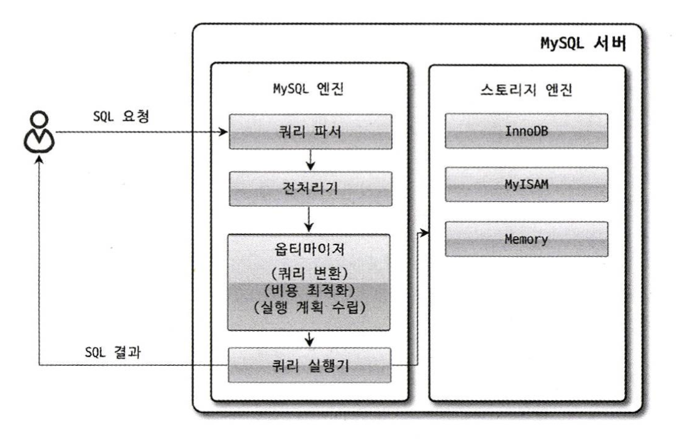

# MySQL 엔진 아키텍처

## MySQL의 전체 구조


MySQL 서버는 `사람의 머리역할을 하는 MySQL 엔진`과 `손발 역할을 담당하는 스토리지 엔진`으로 구분할 수 있다.  

그 중에서 MySQL 엔진은 클라이언트의 접속 및 쿼리 요청을 처리하는 커넥션 핸들러와 SQL 파서 및 전처리기, 쿼리의 최적화된 실행을 위한 옵티마이저가 중심을 이룬다.  
반대로 스토리지 엔진은 실제 데이터를 디스크에 저장하거나 디스크로부터 데이터를 읽어오는 부분을 전담한다.  

#
  
MySQL 서버에서 MySQL 엔진은 하나지만 스토리지 엔진은 여러 개를 동시에 사용하는 것이 가능하다.  

```sql
CREATE TABLE test_table (fd1 INT, fd2 INT) ENGINE=INNODB;
```
 
위와 같이 테이블이 사용할 스토리지 엔진을 지정해서  
지정한 스토리지가 해당 테이블의 모든 읽기 작업이나 변경 작업을 전담하도록 할 수 있다.

---

## MySQL Thread


MySQL 서버는 스레드 기반으로 작동하며, 크게 `포그라운드 스레드`와 `백그라운드 스레드`로 구분할 수 있다.  

MySQL 커뮤니티 에디션에서 사용되는 전통적인 스레드 모델은 커넥션 별로 포그라운드 스레드가 하나씩 생성되고 할당된다.  
  
MySQL 엔터프라이즈 에디션과 Percona MySQL 서버에서는 전통적인 스레드 모델뿐만 아니라 `스레드 풀(Thread Pool)` 모델을 사용할 수도 있다. 
스레드 풀에서는 커넥션과 포그라운드 스레드의 관계가 1:1이 아닌 하나의 스레드가 여러 커넥션을 전담한다.


## Foreground Thread (Client Thread)

포그라운드 스레드는 주로 각 클라이언트 사용자가 요청하는 쿼리 문장을 처리하는 역할을 한다.  
  
MySQL의 데이터 버퍼나 캐시로부터 데이터를 가져오는데,  
버퍼나 캐시에 없는 경우에는 직접 디스크의 데이터나 인덱스 파일로부터 데이터를 읽어와서 작업을 처리한다.

> MyISAM 테이블의 경우 디스크 쓰기 작업까지 포그라운드 스레드가 처리하지만  
> InnoDB 테이블은 데이터 버퍼나 캐시까지만 포그라운드 스레드가 처리하고, 나머지 버퍼로부터 디스크까지 기록하는 작업은 백그라운드 스레드가 처리한다.
  
최소 MySQL 서버에 접속된 클라이언트 수만큼 존재하며, 커넥션이 종료되면 해당 커넥션을 담당하던 스레드는 다시 스레드 캐시로 되돌아간다.  
이때 시스템 변수 `thread_cache_size`로 유지시킬 최대 스레드 개수를 설정해서 일정 개수의 스레드만 스레드 캐시에 존재하도록 할 수 있다.  

#

## Background Thread

InnoDB에서는 MyISAM과 달리 여러가지 작업들이 백그라운드 스레드로 처리된다.  

> Insert Buffer를 병합하는 스레드  
> 로그를 디스크로 기록하는 스레드  
> InnoDB 버퍼 풀의 데이터를 디스크에 기록하는 스레드  
> 데이터를 버퍼로 읽어오는 스레드  
> 잠금이나 데드락을 모니터링 하는 스레드  
  
이 중에서도 가장 중요한 스레드는 `로그 스레드와`, 버퍼의 데이터를 디스크에 기록하는 `쓰기 스레드`이다.  
  
InnoDB에서도 데이터를 읽는 작업은 주로 포그라운드 스레드에서 처리되기 때문에 읽기 스레드의 개수는 많이 설정할 필요가 없지만  
쓰기 스레드는 아주 많은 작업을 백그라운드로 처리하기 때문에 충분히 설정하는 것이 좋다.  

읽는 작업과 달리 쓰는 작업은 아주 많은 작업을 백그라운드 스레드로 처리하기 때문에 일반적인 내장 디스크를 사용할 때는 2~4 정도,  
DAN나 SAN과 같은 스토리지를 사용할 때는 디스크를 최적으로 사용할 수 있을 만큼 충분히 설정하는 것이 좋다.

### 지연 쓰기: InnoDB와 MyISAM

일반적인 상용 DBMS(InnoDB)는 대부분 쓰기 작업을 `버퍼링`해서 일괄 처리하는 기능이 탑재되어 있다.  
이러한 이유로 InnoDB에서는 쿼리로 데이터가 변경되는 경우 데이터가 완전히 디스크에 반영될 때 까지 기다리지 않아도 된다.  
- 사용자는 더 빠른 응답을 받을 수 있고, 작업이 백그라운드에서 처리되는 동안 다른 작업을 수행할 수 있다.
- 더 효율적이고 성능이 향상된다.
  
하지만 MyISAM은 클라이언트 스레드가 쓰기 작업까지 처리하도록 설계되어있기 때문에 일반적인 쿼리는 쓰기 버퍼링 기능을 사용할 수 없다.

---

## 메모리 할당 및 사용 구조


MySQL에서 사용되는 메모리 공간은 `글로벌 메모리 영역`과 `로컬 메모리 영역`으로 구분할 수 있다.  

`글로벌 메모리 영역`의 모든 메모리 공간은  
MySQL의 시스템 변수로 설정해 둔 만큼 MySQL 서버가 시작하면서 운영체제로 부터 할당 받는다.

#

## 글로벌 메모리 영역

> 테이블 캐시  
> InnoDB 버퍼 풀  
> InnoDB 어댑티브 해시 인덱스  
> InnoDB 리두 로그 버퍼  

일반적으로 클라이언트 스레드의 수와 무관하게 `하나의 메모리 공간만 할당`된다.  
이 메모리 공간은 생성된 글로벌 영역이 N개라 하더라도 모든 스레드에 의해 공유된다.  

## 로컬 메모리 영역 (세션 메모리 영역)

> Sort 버퍼  
> 조인 버퍼  
> 바이너리 로그 캐시  
> 네트워크 버퍼

MySQL 서버상에 존재하는 클라이언트 스레드가 쿼리를 처리하는데 사용하는 메모리 영역이다.  
  
로컬 메모리는 `각 클라이언트 스레드 별로 독립적으로 할당`되며 절대 공유되어 사용되지 않는다는 특징이 있다.  
Sort 버퍼나 조인 버퍼의 경우, 필요할 때만 공간이 할당되고 필요하지 않은 경우에는 MySQL이 메모리 공간을 할당조차 하지 않을 수 있다.  

로컬 메모리 공간은 커넥션이 열려있는 동안 계속 할당된 상태로 남아 있는 공간도 있고 (`커넥션 버퍼`, `결과 버퍼`)  
쿼리를 실행하는 순간에만 할당했다가 다시 해제하는 공간도 있다. (`Sort 버퍼`, `조인 버퍼`)

---

## 쿼리 실행 구조



MySQL이 쿼리를 처리하는 과정을 간략하게 나타낸 그림이다.  
SQL 요청이 MySQL 엔진의 쿼리 파서에 들어오는 부분부터 스토리지 엔진에 `핸들러 요청`하는 과정까지 나타낸다.  

### 쿼리 파서

쿼리 파서는 사용자 요청으로 들어온 `쿼리 문장을 Token으로 분리하여 트리 형태의 구조로 만들어 내는` 작업을 의미한다.  
쿼리 문장의 기본적인 문법 오류는 이 과정에서 발견되고 사용자에게 오류 메시지를 전달하게 된다.  

#

### 전처리기

파서에서 만들어진 `트리를 바탕으로 쿼리 문장에 구조적인 문제점이 있는지 확인`한다.  
해당 객체의 존재 여부와 객체의 접근 권한 등을 확인하는 과정을 여기서 수행한다.  

#

### 옵티마이저

DBMS의 두뇌에 해당하며, 사용자의 요청으로 들어온 `쿼리 문장을 저렴한 비용으로 가장 빠르게 처리할지를 결정`하는 역할을 담당한다.  

#

### 실행 엔진

옵티마이저와 핸들러의 중간에서 관리자의 역할을 수행한다.  
실행 엔진은 만들어진 계획대로 각 핸들러에게 요청해서 받은 결과를 또 다른 핸들러 요청의 입력으로 연결하는 역할을 담당한다.  

#

### 핸들러 (스토리지 엔진)

핸들러는 MySQL 서버 가장 밑단에서 실행 엔진의 요청에 따라 `데이터를 디스크에 저장하고 읽어 오는 역할`을 담당한다.  
    
핸들러는 결국 스토리지 엔진을 의미하며  
스토리지 엔진에 따라 `MyISAM 스토리지 엔진`이 될 수도 있고 `InnoDB 스토리지 엔진`이 될 수도 있다.  

---

## 쿼리 캐시

기존 MySQL 서버의 쿼리 캐시는 테이블의 데이터가 변경되면 캐시에 저장된 결과 중 변경된 테이블과 관련된 것들은 모두 삭제해야 했다.  
이는 심각한 동시 처리 성능 저하를 유발했고, MySQL 서버가 발전되면서 쿼리 캐시는 많은 버그의 원인이 되기도 했다.  

MySQL 8.0으로 올라오면서 쿼리 캐시는 MySQL 서버의 기능에서 완전히 제거되었다.  

---

## 스레드 풀

MySQL 서버 엔터프라이즈 에디션에서만 스레드 풀 기능을 제공한다.  
아래는 엔터프라이즈 에디션에 포함된 스레드 풀 대신 Percona Server에서 제공하는 스레드 풀 설명이다.  
  
스레드 풀은 내부적으로 사용자의 요청을 처리하는 스레드 개수를 줄여서 MySQL 서버의 CPU 개수가 제한된 개수의 스레드 처리에만 집중할 수 있게 해서 자원 소모를 줄이는 것이 목적이다. 
때문에 스케줄링 과정에서 CPU 시간을 제대로 확보하지 못하는 경우에는 쿼리 처리가 더 느려질 수도 있다.  

제한된 수의 스레드만으로 CPU가 처리하도록 적절히 유도하면 CPU의 프로세서 친화도를 높이고, 불필요한 컨텍스트 스위치를 줄여 오버헤드를 낮출 수 있다. 
기본적으로 CPU의 코어의 개수와 스레드 수를 맞추는 것이 프로세서 친화도를 높이는데 좋다. 

```ini
[thread_pool_size]

Percona Server의 스레드 풀은 기본적으로 CPU 코어의 개수만큼 스레드 그룹을 생성하는데
스레드 그룹의 개수는 thread_pool_size 시스템 변수를 변경해서 조정할 수 있다.
```

```ini
[thread_pool_oversubscribe]

처리해야 할 요청이 생기면 MySQL 서버는 스레드 풀로 처리를 이관하는데
만약 이미 스레드 풀이 처리중인 작업이 있는 경우
thread_pool_oversubscribe 시스템 변수에 설정된 개수만큼 추가로 더 받아들여서 처리한다

이 값이 너무 크면 스케줄링해야 할 스레드가 많아져서 스레드 풀이 비효율적으로 작동할 수도 있다.
```

```ini
[thread_pool_stall_limit]

스레드 그룹의 모든 스레드가 일을 처리하고 있다면
스레드 풀은 해당 스레드 그룹에 새로운 스레드를 추가할지 아니면 기존 작업 스레드가 처리를 완료할 때 까지 기다릴지 여부를 판단해야한다.

스레드 풀의 타이머 스레드는 주기적으로 스레드 그룹의 상태를 체크해서
thread_pool_stall_limit 시스템 변수에 정의된 시간만큼 기다렸다가,
처리중인 작업이 끝나지 않으면 새로운 스레드를 생성해서 스레드 그룹에 추가한다.

응답 시간에 민감한 서비스라면 thread_pool_stall_limit 시스템 변수를 적절히 낮춰서 설정해야한다.
하지만 그렇다고 0에 가까운 값으로 설정하는 것은 좋지 않으며, 오히려 스레드 풀을 사용하지 않는 편이 낫다.
```

Percona Server의 스레드 풀 플러그인은  
`선순위 큐와 후순위 큐`를 이용해 작업을 재배치하여 특정 트랜잭션이나 쿼리를 우선적으로 처리할 수 있는 기능도 제공한다.  

먼저 시작된 트랜잭션 내에 속한 SQL을 빨리 처리해주면 해당 트랜잭션이 가지고 있던 잠금이 빨리 해제되고 잠금 경합을 낮춰 전체적인 성능을 향상시킬 수 있다.

---

## 트랜잭션 지원 메타데이터

MySQL 8.0 버전부터 메타데이터와 시스템 테이블 모두 InnoDB 스토리지 엔진에 저장되도록 개선됐으며 두 정보를 모두 모아 mysql DB에 저장하고 있다.  
mysql DB는 통째로 mysql.ibd라는 이름의 테이블스페이스에 저장된다. 그래서 MySQL 서버의 데이터 디렉토리에 존재하는 mysql.ibd라는 파일은 다른 ibd 파일과 함께 특별히 주의해야 한다.
> 테이블의 구조 정보와 스토어드 프로그램 등의 정보를 데이터 딕셔너리 또는 메타데이터라 한다.  
> MySQL 서버가 작동하는 데 기본적으로 필요한 테이블들을 시스템 테이블이라 한다.
  
InnoDB가 지원하는 트랜잭션 덕분에 스키마 변경 작업 중간에 MySQL 서버가 비정상적으로 종료된다 하더라도 스키마 변경이 완전한 성공 또는 완전한 실패로 정리된다.
8.0 버전 이전의 파일 기반 메타데이터를 사용할 때 처럼 데이터베이스나 테이블이 깨지는 현상이 더이상 발생하지 않게 된 것이다.


## Reference

**위 내용은 책 RealMySQL 8.0을 구입하여 읽고 정리하였습니다.**
- [도서 홈페이지 https://wikibook.co.kr/realmysql801/](https://wikibook.co.kr/realmysql801/)
- [MySQL 8.0 Document https://dev.mysql.com/doc/refman/8.0/en/pluggable-storage-overview.html](https://dev.mysql.com/doc/refman/8.0/en/pluggable-storage-overview.html)
