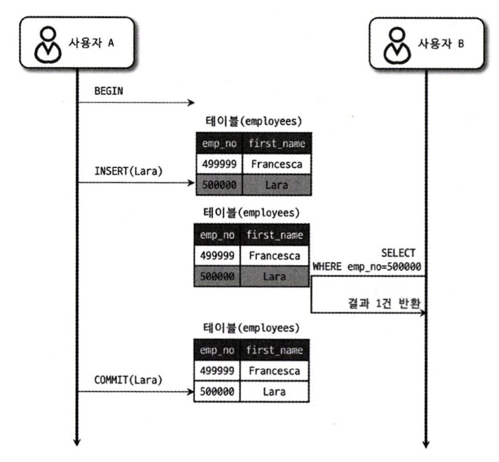
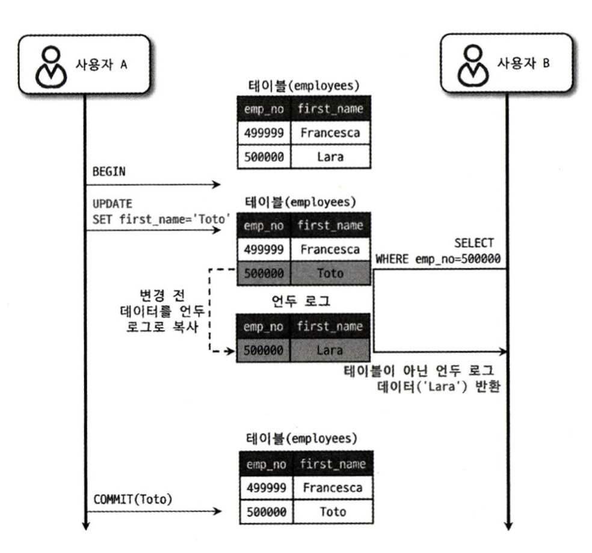
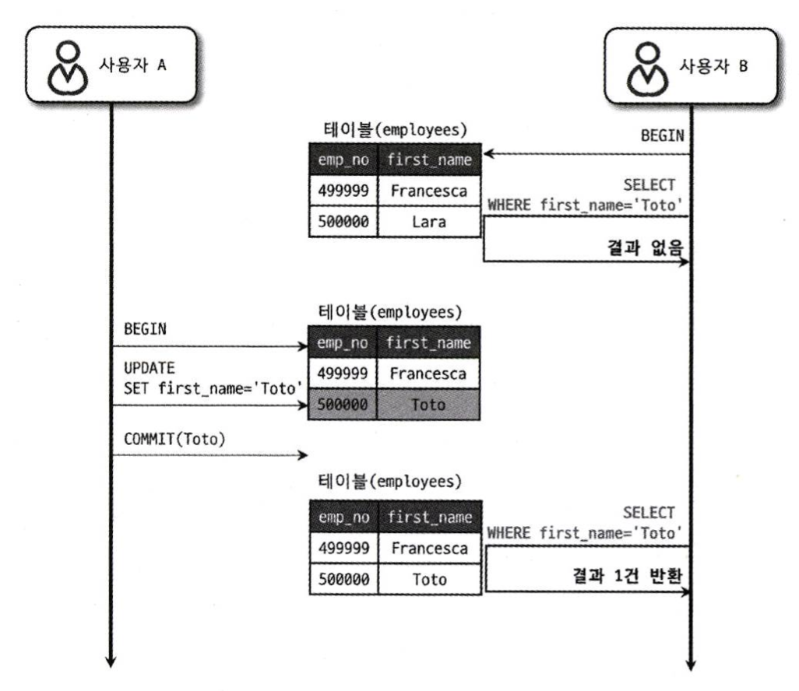
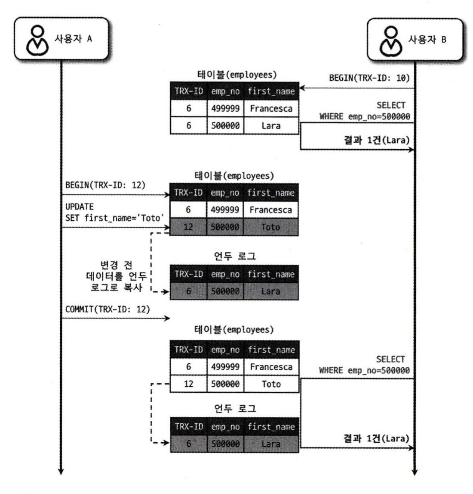

# 트랜잭션과 잠금

## MySQL의 격리 수준

트랜잭션의 격리 수준(isolation level)이란 여러 트랜잭션이 동시에 처리될 때 특정 트랜잭션이 다른 트랜잭션에서 변경하거나 조회하는 데이터를 볼 수 있게 허용할지 말지를 결정하는 것이다.

|고립수준/문제|DIRTY READ|NON-REPEATABLE READ|PHANTOM READ|
|---|---|---|---|
|READ UNCOMMITTED|발생|발생|발생|
|READ COMMITTED|없음|발생|발생|
|REPEATABLE READ|없음|없음|발생|
|SERIALIZABLE|없음|없음|없음|

격리 수준은 4가지로 나뉘며, 4개의 격리 수준에서 뒤로 갈수록 각 트랜잭션 간의 데이터 고립 정도가 높아져서 동시 처리 성능도 떨어지는 것이 일반적이다. 
그런데 보통 `SERIALIZABLE` 격리 수준이 아니라면 크게 성능의 개선이나 저하는 발생하지 않는다.
  
격리수준에 따라 위 표처럼 부정합 문제가 발생하는 것이 일반적이지만, `InnoDB`에서는 독특한 특성 때문에 `REPEATABLE READ` 수준에서 `PHANTOM READ`가 발생하지 않는다.

### READ UNCOMMITTED

격리 수준을 그대로 해석하면 커밋되지 않은 데이터도 읽을 수 있다라는 뜻이다. 그래서 각 트랜잭션에서의 변경 내용이 커밋이나 롤백 여부에 상관없이 다른 트랜잭션에서 보이는 격리 수준이다.



위 그림처럼 `사용자 B`는 `사용자 A`가 `INSERT`한 사원의 정보를 커밋되지 않은 상태에서도 조회할 수 있다.  
이 때 `사용자 A`가 `INSERT`된 내용을 롤백한다 하더라도, `사용자 B`는 그 사실을 알 수 없고 올바른 데이터라고 생각해서 계속 작업을 처리하는 심각한 문제가 발생할 수 있다.  
이러한 현상을 `Dirty Read`(오손 읽기)라 하며, RDBMS 표준에서는 트랜잭션의 격리 수준으로 인정하지 않을 정도로 정합성에 문제가 많은 격리 수준이다.

### READ COMMITTED



`READ COMMITTED`는 다른 트랜잭션에서 커밋이 완료된 데이터만 조회할 수 있다. 그렇기 때문에 `DIRTY READ` 문제는 발생하지 않는다.  
`MVCC`를 이용해서 레코드를 새로운 값으로 변경하면 테이블에는 즉시 새로운 데이터가 기록되고, 이전 데이터는 언두 영역으로 백업된다.  
커밋이 완료되기 전에는 변경 전 데이터를 언두 영역에 백업된 레코드에서 가져와 보여준다. 



`READ COMMITTED` 격리 수준에서도 데이터 부정합 문제가 발생할 수 있다.  

`READ COMMITTED`는 동일한 트랜잭션 내에서 각각의 `SELECT` SQL이 계속해서 새로운 `Snapshot`을 생성 및 초기화하기 때문에 완전한 일관된 읽기를 보장하지 않는다.
  
사용자 B가 먼저 트랜잭션을 시작하고 `Toto`라는 이름의 데이터를 조회했을 때 일치하는 결과가 없다가, 중간에 사용자 A가 특정 사원의 이름을 `Toto`로 변경 후 커밋을 완료하면 사용자 B는 똑같은 SQL을 실행했을 때 이전과는 다른 결과를 조회하게 된다.
  
이러한 부정합 현상은 일반적인 웹 프로그램에서는 크게 문제되지 않을 수 있지만, 하나의 트랜잭션에서 동일 데이터를 여러 번 읽고 변경하는 작업이 금전적인 처리와 연결되면 문제가 될 수도 있다.  
  
또한 READ COMMITTED 격리 수준에서 `Locking Read`, `UPDATE`, `DELETE`의 경우 인덱스 락만을 사용하기 때문에 새로운 데이터가 자유롭게
갭에 삽입, 삭제되어 `PHANTOM READ` 문제가 발생한다.
  
### REPEATABLE READ

MySQL의 `InnoDB` 스토리지 엔진은 기본으로 `REPEATABLE RAED` 격리 수준을 사용한다.  
해당 격리 수준에서는 `DIRTY READ`, `NON-REPEATABLE READ` 부정합 문제가 발생하지 않는다.
  
`InnoDB` 스토리지 엔진의 `REPEATABLE READ`는 트랜잭션이 롤백될 가능성에 대비해 변경되기 전 레코드를 언두 영역에 백업해두고 실제 레코드 값을 변경한다. 
그래서 동일 트랜잭션 내에서는 동일한 결과를 보여줄 수 있게 보장한다.



그런데 `READ COMMITTED`, `REPEATABLE READ` 두 격리 수준의 차이점은 언두 영역에 백업된 레코드의 여러 버전 가운데 몇 번째 이전 버전까지 찾아 들어가느냐에 있다.  
모든 InnoDB의 트랜잭션은 순차적으로 증가하는 고유한 트랜잭션 번호를 가지고 있는데, 언두 영역에 백업된 모든 레코드에는 변경을 발생시킨 트랜잭션의 번호가 포함되어 있다.  
  
`REPEATABLE READ` 격리 수준에서는 `MVCC`를 보장하기 위해 실행 중인 트랜잭션 가운데 가장 오래된 트랜잭션 번호보다 트랜잭션 번호가 앞선 언두 영역의 데이터는 삭제할 수 없다. 
그리고 자신보다 나중에 실행된 트랜잭션이 추가하거나 변경한 레코드는 무시한다. 즉 동일한 트랜잭션 내의 일반적인 `SELECT` SQL의 일관성을 보장하게 된다.
  
`SELECT FOR UPDATE` 같은 `Locking Read`를 사용해서 데이터를 읽게되면 `MVCC`를 활용하더라도 `PHANTOM READ` 문제가 발생한다.  
왜냐하면 `Locking Read`는 데이터 조회를 언두 로그가 아닌 테이블에서 수행하기 때문이다.  
  
`Locking Read`는 데이터 변경을 막기위해 레코드에 쓰기 잠금을 걸게되고, 언두 로그에는 잠금을 걸 수 없다.  
따라서 `SELECT FOR UPDATE`나 `SELECT FOR SHARE`로 레코드를 조회하는 경우 언두 로그의 데이터가 아니라 테이블의 레코드 값을 가져오게 되어 
`PHANTOM READ`문제가 발생하게 된다.
  
그런데 InnoDB 스토리지 엔진은 자신만의 독특한 갭 락과 넥스트 키 락을 활용해서 이 문제를 해결한다.

`Locking Read`, `UPDATE`, `DELETE`문의 경우 검색 조건에 따라 사용하는 잠금이 달라지게 되는데,  

- 고유한 검색 조건이 있는 고유 인덱스에 대한 SQL은 `레코드 락`이 적용된다.
- 범위 검색의 경우 스캔한 인덱스 범위에 `갭 락` 또는 `넥스트 키 락`을 설정하여 다른 트랜잭션이 해당 범위에 접근하는 것을 제한한다.

```
특정 트랜잭션 A가 만약 SELECT WHERE id >= 30 FOR UPDATE SQL 을 실행하면
id가 30인 레코드에는 레코드 락, id가 30을 넘는 레코드에는 갭 락을 걸고 데이터를 조회한다.
그리고 아직 트랜잭션 A는 종료되지 않은 상태이다.

이 때 다른 트랜잭션 B가 id가 51인 새로운 데이터를 INSERT 시도할 시
B 트랜잭션은 갭 락이 걸려있기 때문에 데이터를 추가하지 못하고 A 트랜잭션이 종료될 때 까지 계속 대기하게된다.
```

그렇기 때문에 InnoDB 스토리지 엔진에서 `REPEATABLE READ` 격리 수준은 `넥스트 키 락`을 사용해서 
`PHANTOM READ` 부정합 문제가 발생하지 않는다.

### SERIALIZABLE

말 그대로 직렬 가능한 격리 수준을 의미한다. 그래서 인터 리빙 방식을 사용하지 않기 때문에 동시 처리 성능도 다른 트랜잭션 격리 수준보다 떨어진다.
  
순수한 `SELECT` SQL의 경우 아무런 레코드 잠금을 설정하지 않고 실행되지만, 격리 수준이 `SERIALIZABLE` 일 경우 읽기 작업도
잠금을 획득해야 하며, 다른 트랜잭션은 해당 레코드에 잠금이 풀릴 때 까지 접근할 수 없다.

## Reference 

**위 글은 책 RealMySQL 8.0을 구입하여 읽고 정리한 내용입니다.**
- [도서 홈페이지 https://wikibook.co.kr/realmysql801/](https://wikibook.co.kr/realmysql801/)
